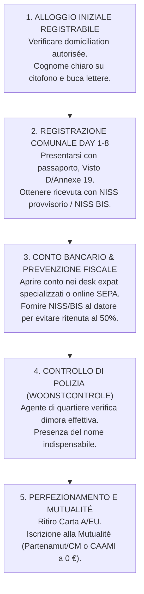

# Guida Ufficiale Visti e Immigrazione: Belgio

> **Regola di integrità:** Questo documento costituisce l'**UNICA fonte di verità** del progetto Admetia per il Belgio. Ogni dato numerico, tariffa, soglia di reddito o requisito procedurale reca un riferimento univoco `[ID-fonte]` collegato al registro ufficiale [`belgium_sources.md`](belgium_sources.md). I punti soggetti a divergenza prasseologica o a monitoraggio normativo sono catalogati in [`belgium_open_questions.md`](belgium_open_questions.md).

---

## 1. Architettura Giuridica ed Enti Competenti

Il sistema dell'immigrazione e del soggiorno belga è fondato su una complessa articolazione multilivello:

- **Livello Federale (Soggiorno, Frontiere, Visti e Sicurezza Nazionale):**
  - **Office des Étrangers (OE) / Dienst Vreemdelingenzaken (DVZ):** Direzione generale del Servizio Pubblico Federale Interno (*SPF Intérieur*), autorità sovrana in materia di ammissione, soggiorno, regolarizzazione ed espulsione `[BE-SRC-01]`, `[BE-SRC-04]`.
  - **SPF Affaires étrangères, Commerce extérieur et Coopération au développement:** Amministrazione centrale e rete consolare estera, competente per l'istruttoria e il rilascio dei visti di breve (Visto C Schengen) e lungo soggiorno (Visto D nazionale) `[BE-SRC-13]`.
- **Livello Regionale (Mercato del Lavoro e Politiche dell'Impiego):**
  A seguito della 6ª Riforma dello Stato, la migrazione economica è competenza esclusiva delle tre Regioni:
  - **Regione Fiamminga (*Vlaanderen*):** *Departement Werk en Sociale Economie (WSE)* `[BE-SRC-05]`, `[BE-SRC-07]`.
  - **Regione di Bruxelles-Capitale (*Région de Bruxelles-Capitale*):** *Bruxelles Économie et Emploi* `[BE-SRC-08]`, `[BE-SRC-09]`.
  - **Regione Vallona (*Région Wallonne*):** *Service public de Wallonie (SPW) Emploi* `[BE-SRC-10]`, `[BE-SRC-11]`.
  - **Comunità Germanofona (*Deutschsprachige Gemeinschaft*):** *Ministerium der DG*.
- **Livello Locale (Anagrafe, Polizia Locale e Consegna Titoli):**
  - **Amministrazioni Comunali (*Communes / Gemeenten* - 581 municipalità):** Esecuzione materiale dell'iscrizione nel Registro degli Stranieri (*Registre des étrangers*), verifica di residenza domiciliare tramite gli agenti di quartiere (*enquête de police / woonstcontrole*) e rilascio delle carte elettroniche di soggiorno plastificate (Carte A, H, EU, F) `[BE-SRC-27]`, `[BE-SRC-30]`, `[BE-SRC-31]`.
- **Sportello Unico Telematico:**
  - **Working in Belgium (`workinginbelgium.be`):** Piattaforma telematica unificata per la gestione congiunta delle domande di Single Permit (*Permis unique / Gecombineerde vergunning*) `[BE-SRC-03]`, `[BE-SRC-34]`.

---

## 2. Matrice dei Casi d'Uso (Dettaglio Operativo UE vs Extra-UE)

---

### Caso 1: Lavoro Dipendente Ordinario (Single Permit con Arbeidsmarktonderzoek)

#### A. Cittadini UE / SEE / Svizzera
- **Regime giuridico:** Libera circolazione dei lavoratori (art. 45 TFUE). Nessun visto, nessuna autorizzazione al lavoro né quota.
- **Procedura all'arrivo:** 
  1. Ingresso libero sul territorio belga.
  2. Entro 3 mesi dall'ingresso, presentazione al comune di residenza della domanda di registrazione (*Demande d'attestation d'enregistrement*) con rilascio immediato dell'**Annexe 19** `[BE-SRC-01]`.
  3. **Riforma del 1° settembre 2025:** Obbligo di presentare il **dossier tassativamente completo al day 1** (allegato contrattuale *Annexe 19bis* compilato dal datore di lavoro belga o copia del contratto di lavoro subordinato conforme, documento d'identità e prova di alloggio). Il vecchio termine di grazia trimestrale per integrare documenti è stato abrogato: se il dossier è incompleto, scatta il rigetto immediato con **Annexe 19quinquies** `[BE-SRC-02]`.
  4. L'agente di polizia municipale (*wijkagent / agent de quartier*) effettua l'accertamento domiciliare (*woonstcontrole*).
  5. Ad esito positivo, il comune rilascia l'attestato di registrazione formale (**Annexe 8**) e la carta di soggiorno elettronica **Carte EU** (ex Carte E), valida 5 anni `[BE-SRC-01]`, `[BE-SRC-30]`.
- **Costi:** Nessuna redevance federale. Solo imposta comunale per l'emissione della tessera: **25,00 € - 35,00 €** standard (fino a 150 € per procedura urgente) `[BE-SRC-31]`.

#### B. Cittadini Extra-UE (Single Permit Ordinario)
- **Regime giuridico:** Accord de coopération del 2 febbraio 2018 e Artt. 61/25-1 a 61/25-7 Legge 15/12/1980 `[BE-SRC-04]`, `[BE-SRC-34]`.
- **Legittimazione esclusiva:** Il lavoratore **non può fare domanda da solo**. La richiesta deve essere introdotta esclusivamente dal datore di lavoro belga tramite *Working in Belgium* `[BE-SRC-03]`.
- **Esame del mercato del lavoro (*Arbeidsmarktonderzoek / Examen du marché de l'emploi*):** Il datore di lavoro deve preventivamente pubblicare la vacanza sui portali regionali (VDAB nelle Fiandre, Actiris a Bruxelles, Le Forem in Vallonia) e dimostrare l'impossibilità di reperire manodopera locale o comunitaria entro tempi ragionevoli.
- **Istruttoria e Decisione:**
  1. La Regione esamina l'autorizzazione di lavoro (*toelating tot arbeid*).
  2. L'Office des Étrangers esamina i requisiti di soggiorno e ordine pubblico.
  3. All'esito positivo congiunto, l'IBZ notifica l'**Annexe 46** (*Bijlage 46*) sia al datore che al lavoratore `[BE-SRC-04]`.
- **Visto D consolare e arrivo:**
  1. Con l'Annexe 46, il lavoratore richiede il **Visto D** (codice B29) presso l'ambasciata/consolato belga competente all'estero.
  2. All'arrivo in Belgio, registrazione al comune entro **8 giorni lavorativi** `[BE-SRC-04]`.
  3. Superata la *woonstcontrole*, rilascio della **Carta A** (menzione: *"Marché de l'emploi : limité"* al datore e al settore autorizzato) `[BE-SRC-27]`.
- **Costi obbligatori 2026:**
  - Redevance federale IBZ (dovuta dal lavoratore): **152,00 €** `[BE-SRC-26]`.
  - Tassa regionale fiamminga (*Vlaamse retributie*, solo nelle Fiandre dal 01/09/2026): **180,00 €** via Uniek Loket `[BE-SRC-06]` (0 € a Bruxelles e Vallonia).
  - Tassa consolare Visto D (in vigore dal 01/07/2026): **250,00 €** `[BE-SRC-13]`.
  - Carta elettronica al comune: **~25,00 € - 35,00 €** `[BE-SRC-31]`.
- **Tempi:** Termine legale di **4 mesi (120 giorni)** dalla completezza dell'istanza `[BE-SRC-34]`. Tempi reali de facto: 2,5-4 mesi nelle Fiandre; 3-5 mesi a Bruxelles e in Vallonia.
- **Errori comuni & trappole:**
  - *Tentativo di domanda individuale:* Il lavoratore paga agenzie terze per un Single Permit inesistente: truffa immediata `[BE-SRC-03]`.
  - *Viaggi con sola Annexe 49:* Se il visto D scade prima dell'emissione della Carta A, il comune rilascia l'Annexe 49. **Divieto assoluto di viaggiare fuori dal Belgio con Annexe 49**: non è riconosciuta nel Codice Frontiere Schengen e causa negato imbarco aeroportuale (IATA Timatic).

---

### Caso 2: Lavoro Altamente Qualificato (Single Permit Alta Qualifica & Carta Blu UE)

#### A. Cittadini UE / SEE / Svizzera
- Accesso libero e incondizionato con Carta EU `[BE-SRC-01]`.

#### B. Cittadini Extra-UE: Canale 1 – Single Permit Alta Qualifica (Hooggeschoold / Hautement qualifié)
- **Requisiti:** Diploma di istruzione superiore terziaria (almeno Bachelor di 3 anni, EQF 6+) e contratto di lavoro subordinato conforme alle soglie retributive regionali.
- **Esenzione:** **Completamente esente dall'esame del mercato del lavoro** (*arbeidsmarktonderzoek*) `[BE-SRC-05]`, `[BE-SRC-08]`, `[BE-SRC-10]`.
- **Soglie salariali minime 2026 per Regione:**
  - **Regione Fiamminga (*Vlaanderen*):**
    - Standard ($\ge 30$ anni): **48.912,00 € lordi/anno** `[BE-SRC-07]`.
    - Ridotta (under 30 o professioni infermieristiche/docenti): **39.129,60 € lordi/anno** (80%) `[BE-SRC-07]`.
    - Personale dirigente (*Leidinggevend*): **78.259,00 € lordi/anno** `[BE-SRC-07]`.
  - **Regione di Bruxelles-Capitale:**
    - Standard: **3.703,44 € lordi/mese** (parametrato al 78% del salario medio regionale, pari a circa ~51.551,88 € annui su base 13,92 mensilità) `[BE-SRC-09]`. Nessuna riduzione under 30.
    - Personale dirigente: **6.647,20 € lordi/mese** (140% del salario medio brussellese, ~92.529 € lordi/anno) `[BE-SRC-09]`.
  - **Regione Vallona (*Wallonie*):**
    - Standard ($\ge 30$ anni): **53.220,00 € lordi/anno** `[BE-SRC-11]`.
    - Ridotta (under 30): **42.576,00 € lordi/anno** (80%) `[BE-SRC-11]`.
    - Personale dirigente: **88.790,00 € lordi/anno** `[BE-SRC-11]`.
- **Titolo rilasciato:** **Carta A** (rinnovabile annualmente).

#### C. Cittadini Extra-UE: Canale 2 – Carta Blu UE (European Blue Card, Dir. 2021/1883)
- **Quadro normativo:** Riforma entrata in vigore nel 2024 (recepimento Direttiva UE 2021/1883) `[BE-SRC-12]`.
- **Requisiti contrattuali:** Contratto di lavoro di durata minima di **almeno 6 mesi** (scesa dai precedenti 12 mesi).
- **Requisiti professionali:** Laurea triennale (EQF 6+) o esperienza professionale specialistica qualificata di almeno 3 anni (settore ICT) o 5 anni (in generale) negli ultimi 7 anni.
- **Soglie salariali minime 2026 per Regione:**
  - **Fiandre:** **63.586,00 € lordi/anno** `[BE-SRC-07]`.
  - **Bruxelles-Capitale:** **4.748,00 € lordi/mese** (100% del salario medio regionale, pari a ~66.092 € lordi/anno su 13,92 mensilità) `[BE-SRC-09]`.
  - **Vallonia:** **68.815,00 € lordi/anno** (soglia ordinaria) oppure **55.052,00 € lordi/anno** (soglia ridotta junior per laureati da meno di 3 anni o professioni carenti) `[BE-SRC-11]`.
- **Titolo rilasciato:** **Carta H** (*Europese blauwe kaart*), valida fino a 3 anni o durata contrattuale $+ 3$ mesi `[BE-SRC-12]`, `[BE-SRC-27]`.
- **Vantaggi esclusivi Carta H:** Mobilità intra-UE dopo 12 mesi di soggiorno nel primo Stato membro; ricongiungimento familiare immediato del coniuge senza periodo di attesa di 12 mesi con diritto istantaneo al lavoro.
- **Costi e tempi:** Redevance federale **152,00 €** `[BE-SRC-26]`; tassa fiamminga **180,00 €** (se applicabile) `[BE-SRC-06]`; visto consolare D **250,00 €** `[BE-SRC-13]`; carta comunale **~30,00 €** `[BE-SRC-31]`. Tempi istruttori: 60-90 giorni.

---

### Caso 3: Internship / Tirocinio (Curriculare vs Extracurriculare CIP/BIO)

#### A. Tirocinio Curriculare Universitario (*Stage faisant partie d'un programme d'études*)
- **Definizione:** Tirocinio obbligatorio o accreditato inserito nel piano di studio ufficiale di un istituto superiore o università riconosciuta (belga o estera UE/SEE) `[BE-SRC-21]`.
- **ESENZIONE TOTALE:** Il tirocinante è **completamente esente da autorizzazione al lavoro e da Single Permit** (art. 2, 41° AR 09/06/1999) `[BE-SRC-21]`.
- **Cittadini UE:** Libero svolgimento con convenzione tripartita (università, studente, azienda). Registrazione comunale come studente (Carta EU) `[BE-SRC-01]`.
- **Cittadini Extra-UE:** Se già residenti come studenti in Belgio, coperto dalla Carte A da studente. Se provenienti dall'estero solo per il tirocinio: Visto D studio/stage con la sola convenzione universitaria approvata.

#### B. Tirocinio Extracurriculare Post-Laurea (*Convention d'immersion professionnelle - CIP / Beroepsinlevingsovereenkomst - BIO*)
- **Inquadramento:** Disciplinato dalla Legge del 2 agosto 2002 e regolamenti regionali.
- **Divieto di gratuità:** È obbligatoria per legge un'indennità mensile minima (*indemnité d'immersion*), fissata nel 2026 tra **900,00 € e 1.050,00 € netti/mese** a seconda dell'età del tirocinante.
- **Cittadini UE:** Stipula della convenzione CIP, approvazione del piano formativo presso il servizio regionale per l'impiego competente (VDAB, Actiris, Forem) e registrazione comunale ordinaria.
- **Cittadini Extra-UE:**
  - Requisiti anagrafici: Età compresa tra **18 e 30 anni compiuti** al momento della richiesta `[BE-SRC-21]`.
  - Durata massima legale: **12 mesi improrogabili**.
  - Procedura: Richiesta di **Single Permit pour stagiaire** presentata dall'azienda su *Working in Belgium* `[BE-SRC-03]`, corredata da piano formativo dettagliato approvato dalla Regione.
  - Decisione Annexe 46 $\rightarrow$ Visto D $\rightarrow$ Registrazione al comune $\rightarrow$ Carta A (validità pari alla durata del tirocinio).
  - Costi: Redevance federale **152,00 €** `[BE-SRC-26]` $+$ visto D **250,00 €** `[BE-SRC-13]` $+$ carta comunale **~30,00 €** `[BE-SRC-31]`.

---

### Caso 4: Studio Universitario (Bachelor / Master / Dottorato)

#### A. Cittadini UE / SEE / Svizzera
- Libera circolazione. Nessun visto.
- Registrazione al comune entro 3 mesi tramite **Annexe 19** `[BE-SRC-01]`.
- Documenti: Documento d'identità valido, attestato di iscrizione universitaria (*attestation d'inscription*), tessera sanitaria europea TEAM (o iscrizione alla Mutualité belga), dichiarazione di risorse sufficienti per non gravare sul sistema sociale `[BE-SRC-01]`. Riforma 01/09/2025: dossier completo immediato `[BE-SRC-02]`.
- Rilascio **Annexe 8** e successiva **Carta EU** `[BE-SRC-01]`, `[BE-SRC-30]`.

#### B. Cittadini Extra-UE (Visto D Studio - Artt. 58-60 Legge 15/12/1980)
- **Requisiti finanziari 2026/2027 (Proof of Funds):**
  - Importo minimo di sussistenza netto: **1.062,00 € netti/mese** (`[BE-SRC-15]`), pari a **12.744,00 € annui** su base 12 mesi.
  - Tre modalità tassative di dimostrazione:
    1. **Conto Bloccato (*Blocked Account / Compte bloqué*):** Versamento integrale dei 12.744 € sul conto vincolato dell'università belga (es. KU Leuven, UGent, UCLouvain, ULB) o di intermediari certificati (Studely, RSGI) `[BE-SRC-15]`, `[BE-SRC-32]`. L'ente rilascia l'attestazione ufficiale per l'ambasciata e liquida 1.062 €/mese all'arrivo.
    2. **Atto di presa in carico (*Annexe 32 / Bijlage 32*):** Garanzia fideiussoria formale di un garante (in Belgio o all'estero) `[BE-SRC-16]`. Dal **1° settembre 2026**, il garante deve dimostrare un reddito netto mensile stabile di almeno **3.279,47 € netti/mese** (120% RIS = 2.217,47 € + quota studente 1.062,00 €). Se risiede all'estero, deve essere parente fino al 3° grado e autenticare l'atto in ambasciata `[BE-SRC-16]`.
    3. **Borsa di studio ufficiale:** Lettera di assegnazione di borsa pari o superiore a 1.062 €/mese `[BE-SRC-15]`.
- **Procedura operativa:**
  1. Iscrizione o ammissione definitiva ad ateneo riconosciuto.
  2. Versamento della **Redevance federale IBZ di 251,00 €** sul conto BPOST dell'Office des Étrangers con causale tassativa: `COGNOME Nome Nazionalità GGMMAAAA` `[BE-SRC-26]`.
  3. Domanda di **Visto D** (codice B11) all'ambasciata (costo consolare **250,00 €** `[BE-SRC-13]` + quota VFS/TLS ~30 €).
  4. Ingresso in Belgio e registrazione in comune entro **8 giorni lavorativi** `[BE-SRC-15]`.
  5. *Woonstcontrole* della polizia, rilascio Annexe 15 e consegna della **Carta A** per studenti (validità 1 anno accademico, fino al 31 ottobre dell'anno successivo) `[BE-SRC-27]`.
- **Lavoro durante lo studio:**
  - Massimo **20 ore a settimana** durante i periodi di lezione `[BE-SRC-17]`.
  - **Ore illimitate** durante le vacanze scolastiche ufficiali `[BE-SRC-17]`.
  - Contratto per studenti (*étudiant jobiste*) con contributi di solidarietà ridotti (2,71% studente) fino a un contingente di **600 ore all'anno** su *studentatwork.be*.
- **Rinnovo annuale:** Prova di fondi rinnovata (1.062 €/mese), iscrizione all'anno accademico successivo, e superamento del rendimento accademico minimo (almeno 45 crediti ECTS nell'arco del biennio).

---

### Caso 5: Tesi / Ricerca all'Estero (Visiting Student vs Ricercatore Scientifico)

#### A. Visiting Student (Preparazione Tesi all'Estero)
- Se il soggiorno è $\le 90$ giorni: Visto C o esenzione turistica con dichiarazione Annexe 3 `[BE-SRC-23]`.
- Se il soggiorno è $> 90$ giorni: Visto D studio (art. 58) come visiting research student, oppure mobilità intra-UE ex Dir. 2016/801 se titolare di permesso in altro Stato UE `[BE-SRC-15]`.

#### B. Ricercatore Scientifico con Hosting Agreement (*Convention d'accueil / Gastovereenkomst*)
- **Base giuridica:** Artt. 61/10 a 61/13 Legge 15/12/1980 e Direttiva (UE) 2016/801 `[BE-SRC-19]`.
- **Requisiti:** Titolo di studio di livello Master (EQF 7+) e sottoscrizione della convenzione con un istituto di ricerca accreditato da BELSPO (es. imec, SCK CEN, VIB, università) `[BE-SRC-19]`, `[BE-SRC-20]`.
- **ESENZIONE DAL SINGLE PERMIT:** La convenzione d'accoglienza ha valore legale di autorizzazione al lavoro: **nessun passaggio presso i dipartimenti regionali del lavoro**. L'istituto garantisce la copertura economica e i costi di soggiorno/rimpatrio fino a 6 mesi post-progetto `[BE-SRC-19]`.
- **Procedura:** Domanda accelerata di Visto D (codice B32) $\rightarrow$ Arrivo e registrazione comunale entro 8 giorni $\rightarrow$ Rilascio **Carta A** (o Carta H) recante la menzione *"Chercheur"* `[BE-SRC-19]`.
- **Mobilità intra-UE:** Diritto a svolgere soggiorni di ricerca in altri Stati UE fino a 180 giorni (mobilità breve) o 360 giorni (mobilità lunga su notifica) senza nuovo visto nazionale.
- **Costi:** Redevance federale **152,00 €** `[BE-SRC-26]`; visto D **250,00 €** `[BE-SRC-13]`; carta comunale **~30,00 €** `[BE-SRC-31]`.

---

### Caso 6: Erasmus+ e Mobilità Intra-UE

#### A. Studenti UE in mobilità Erasmus+
- Coperti dalla tessera TEAM (EHIC).
- Soggiorni $\le 3$ mesi: nessuna formalità o dichiarazione di presenza.
- Soggiorni $> 3$ mesi: dichiarazione al comune entro 3 mesi con Annexe 19 esibendo il Learning Agreement Erasmus+ e la TEAM `[BE-SRC-01]`.

#### B. Studenti Extra-UE con Titolo di Soggiorno di Altro Stato UE (Dir. 2016/801)
- **Regola di esenzione dal visto:** Lo studente extra-UE regolarmente soggiornante in un altro Paese UE nell'ambito di un programma di mobilità dell'Unione (Erasmus+, Erasmus Mundus) o accordo interuniversitario **NON DEVE RICHIEDERE IL VISTO D BELGA** `[BE-SRC-15]`.
- **Procedura di notifica preventiva all'Office des Étrangers:**
  1. L'università di accoglienza belga trasmette la notifica di mobilità all'Office des Étrangers prima dell'arrivo.
  2. Documenti: Permesso di soggiorno dell'altro Stato UE valido, prova di copertura finanziaria (1.062 €/mese) e assicurazione sanitaria.
  3. L'Office des Étrangers ha **30 giorni** per sollevare obiezioni (regime di silenzio-assenso).
  4. All'arrivo in Belgio, registrazione entro 8 giorni al comune con ricevuta della notifica: il comune rilascia l'**Annexe 15** che autorizza il soggiorno fino a un massimo di **360 giorni** `[BE-SRC-15]`.

---

### Caso 7: Master di I/II Livello e Dottorato di Ricerca (PhD)

In Belgio i percorsi di Dottorato (PhD) prevedono tre inquadramenti giuridici e fiscali distinti:

1. **Dottorando con Contratto di Lavoro Universitario (*Doctorant contractuel / Navorser*):**
   - Inquadrato come dipendente (*Assistant de recherche*).
   - Assoggettato a piena contribuzione previdenziale ONSS/RSZ e imposizione fiscale ordinaria. Genera anzianità pensionistica e diritti alla disoccupazione.
   - Titolo: Hosting Agreement ex art. 61/10 o Single Permit scientifico `[BE-SRC-19]`.
2. **Dottorando con Borsa di Studio Esente da Imposte (*Doctoraatsbeurs* - FWO / F.R.S.-FNRS / Borse BOF):**
   - **Regime di totale esenzione fiscale:** La borsa di studio è esente dall'imposta sulle persone fisiche ex **art. 90, 2° CIR 92** (*Code des impôts sur les revenus*).
   - Sicurezza sociale speciale: Copertura sanitaria e infortuni garantita, ma non matura anzianità per la pensione ordinaria né indennità di disoccupazione piena.
   - Retribuzione netta media: compresa tra **2.400,00 € e 2.850,00 € netti/mese**.
   - Titolo migratorio: Hosting Agreement (art. 61/10) o Carta A ricercatore borsista `[BE-SRC-19]`.
3. **Dottorando Autofinanziato / Borsa Estera (Status Studente puro):**
   - Inquadrato come studente di 3° ciclo. Titolo: Visto D Studio ex art. 58 e Carta A per studio `[BE-SRC-15]`.
   - Limite rigido di 20 ore settimanali per attività lavorative accessorie `[BE-SRC-17]`.

---

### Caso 8: Working Holiday / Vacanza-Lavoro (Programme Vacances-Travail - PVT)

- **Accordi bilaterali in vigore (5 Paesi):** **Australia, Nuova Zelanda, Canada, Taiwan, Corea del Sud** `[BE-SRC-22]`.
- **Requisiti:** Età compresa tra **18 e 30 anni compiuti** al deposito; viaggiare senza familiari a carico; fondi minimi di circa **2.500,00 €** sul conto bancario + biglietto aereo di andata e ritorno; polizza sanitaria integrale di 12 mesi; casellario giudiziale integro `[BE-SRC-22]`.
- **Procedura:** Domanda presentata esclusivamente presso l'ambasciata belga nel Paese d'origine. Rilascio di Visto D con dicitura *"Vacances-Travail"*. Registrazione al comune entro 8 giorni e rilascio di **Carta A valida 12 mesi** `[BE-SRC-22]`.
- **Condizioni di lavoro:** Esenzione da autorizzazione al lavoro / Single Permit per lavori temporanei e accessori; limite massimo di 6 mesi di impiego presso lo stesso datore di lavoro `[BE-SRC-22]`.
- **VINCOLO TASSATIVO DI NON-CONVERSIONE:**
  - Il titolo dura al massimo 12 mesi e **NON può essere prorogato per nessun motivo**.
  - **Divieto di conversione in Belgio:** Il titolare **non può convertire il proprio titolo in Single Permit, studio o ricongiungimento dall'interno del Belgio**. Ha l'obbligo giuridico di lasciare il Paese e avviare qualsiasi nuova procedura dall'estero `[BE-SRC-22]`.

---

### Caso 9: Post-Study Work / Zoekjaar (Orientamento / Ricerca Lavoro 12 Mesi ex Dir. 2016/801)

- **Quadro normativo:** Artt. 61/32 a 61/35 della Legge 15/12/1980 (Direttiva UE 2016/801) `[BE-SRC-18]`.
- **Aventi diritto:** Cittadini extra-UE che abbiano conseguito con successo un Bachelor, Master o Dottorato in Belgio, o ricercatori al termine di una convenzione di accoglienza `[BE-SRC-18]`.
- **Durata:** **12 mesi esatti, non rinnovabili (*eenmalig en niet-verlengbaar*)** `[BE-SRC-18]`.
- **DEADLINE TASSATIVA DI DEPOSITO:**
  - La domanda deve essere introdotta presso l'amministrazione comunale **ALMENO 15 GIORNI PRIMA DELLA SCADENZA DELLA CARTA A DA STUDENTE IN CORSO DI VALIDITÀ** `[BE-SRC-18]`.
  - Se la domanda è presentata con meno di 15 giorni di anticipo o a permesso scaduto, l'istanza è dichiarata irricevibile senza appello e viene notificato l'ordine di lasciare il territorio.
- **Requisiti economici e documentali:**
  1. Attestato di conseguimento del titolo di studio (*attestation de réussite / getuigschrift van slagen*) o diploma.
  2. Prova di mezzi di sussistenza per 12 mesi (12 x 1.062 € = **12.744,00 €** tramite conto bloccato, risorse proprie o Annexe 32 garante con 3.279,47 €/mese) `[BE-SRC-15]`, `[BE-SRC-16]`.
  3. Copertura sanitaria valida (Mutualité).
- **Status di attesa e titolo rilasciato:**
  - Durante l'istruttoria il comune rilascia l'**Annexe 49** `[BE-SRC-18]`.
  - All'accoglimento, rilascio di **Carta A** con menzione espressa: *"Marché de l'emploi : illimité"* `[BE-SRC-18]`.
- **Diritti lavorativi:** Durante i 12 mesi il neolaureato può svolgere **qualsiasi impiego a tempo pieno senza restrizioni di settore né vincoli di ore**, per mantenersi durante la ricerca del posto qualificato `[BE-SRC-18]`.
- **Conversione in loco:** Appena reperito un impiego qualificato conforme alle soglie regionali (Single Permit Alta Qualifica con soglia agevolata under 30: €39.129,60 nelle Fiandre, €42.576 in Vallonia; oppure Carta Blu UE), il datore attiva la domanda su *Working in Belgium*. La conversione avviene **direttamente dall'interno del Belgio senza necessità di rientro all'estero** `[BE-SRC-03]`, `[BE-SRC-18]`.

---

### Caso 10: Soggiorni Brevi (≤ 90 gg) e Ricongiungimento Familiare

#### A. Soggiorni Brevi (≤ 90 Giorni) & Obbligo di Annexe 3 / Bijlage 3
- **Titolo:** Visto Schengen C o esenzione dal visto per viaggiatori visa-free (es. USA, UK, Canada) `[BE-SRC-23]`.
- **Obbligo di dichiarazione di presenza:**
  - *In hotel/strutture ricettive:* Registrazione automatica tramite scheda d'alloggio (*fiche d'hébergement*).
  - *In alloggio privato (amici, parenti, Airbnb non registrato):* Il viaggiatore extra-UE ha l'**obbligo tassativo di presentarsi al comune entro 3 giorni lavorativi dall'arrivo** per sottoscrivere la *Déclaration d'arrivée* (**Annexe 3** / *Bijlage 3*) `[BE-SRC-23]`. Per i cittadini UE l'obbligo è entro 10 giorni lavorativi (**Annexe 3ter**).
  - La mancata dichiarazione configura soggiorno irregolare punibile con sanzione amministrativa.
  - *Divieto di lavoro e conversione:* Il soggiorno breve non consente alcuna attività lavorativa subordinata né può essere convertito in loco in permesso di soggiorno per studio o lavoro.
  - *Inquadramento giuridico della conversione (art. 9 e 9bis Legge 15/12/1980):* l'**art. 9** stabilisce che, per soggiornare oltre il termine di soggiorno breve (art. 6), lo straniero deve essere **autorizzato** dal Ministro o dal suo delegato e che, salvo deroghe previste da trattato, legge o regio decreto, l'autorizzazione va chiesta **al posto diplomatico o consolare belga competente per il luogo di residenza o soggiorno all'estero**. Questo vale anche per i cittadini esenti da visto (USA, UK, Canada, ecc.): l'ingresso senza visto per 90 giorni non è una via d'accesso a studio o lavoro di lunga durata. L'**art. 9bis** prevede come eccezione che, **in circostanze eccezionali** e se lo straniero dispone di un documento d'identità, l'autorizzazione possa essere chiesta al **sindaco** del comune in cui soggiorna, che la trasmette al Ministro; se accordata, viene rilasciata in Belgio. Il testo esclude espressamente alcune categorie di elementi dalle «circostanze eccezionali» (es. elementi già respinti in una domanda di protezione internazionale). L'art. 9ter riguarda i motivi medici. `[BE-SRC-36]`

#### B. Ricongiungimento Familiare di Cittadini Extra-UE (Artt. 10 e 10bis Legge 15/12/1980)
- **Periodo di attesa dello sponsor:** Residenza legale in Belgio da almeno 12 mesi con titolo di durata non inferiore a 1 anno (Single Permit, Carta A).  
  *Esenzione:* I titolari di **Carta Blu UE (Carta H)** e i **ricercatori con Hosting Agreement (art. 61/10)** possono depositare la domanda di ricongiungimento **simultaneamente** senza attendere i 12 mesi `[BE-SRC-12]`, `[BE-SRC-19]`.
- **Requisiti economici minimi (Soglie di legge):**
  - **Regime Transitorio (120% del RIS):** Valido per domande introdotte nel periodo transitorio biennale (2025-2027) o in continuità di soggiorno `[BE-SRC-24]`. Importo minimo netto aggiornato al 1° settembre 2026: **2.217,47 € netti/mese** (120% del RIS per persona con famiglia a carico pari a 1.847,89 €).
  - **Nuovo Regime (Legge 18 luglio 2025 - Parametro RMMMG):** Parametrato al **110% del RMMMG netto** `[BE-SRC-24]`, `[BE-SRC-35]`, pari a **2.456,97 € netti/mese** al 1° luglio 2026 ($+10\%$ per ogni ulteriore persona a carico).
  - **Cumulo dei redditi:** In forza dell'**Arrêt n° 38/2026 della Corte Costituzionale (02/04/2026)**, in caso di ricongiungimento con un partner straniero, l'Office des Étrangers è obbligato a computare cumulativamente i redditi di entrambi i coniugi/partner `[BE-SRC-25]`.
- **Requisiti alloggiativi e sanitari:** Alloggio idoneo registrato (*logement suffisant*) e copertura assicurativa sanitaria privata o mutuelle per tutti i membri della famiglia.
- **Costi:** Redevance federale di **218,00 €** per ogni familiare maggiorenne `[BE-SRC-26]`; tassa consolare Visto D **250,00 €** a persona `[BE-SRC-13]`.
- **Titolo rilasciato:** **Carta A** con durata agganciata a quella dello sponsor. Il coniuge acquisisce accesso libero al mercato del lavoro belga.

#### C. Ricongiungimento Familiare con Cittadini dell'Unione Europea (Artt. 40bis – 47 Legge 15/12/1980)
- Domanda presentata al comune con **Annexe 19ter** `[BE-SRC-01]`.
- Istruttoria massima di 6 mesi coperta da **Annexe 15** con diritto immediato al lavoro.
- Rilascio della **Carta F** (*Carte de séjour de membre de la famille d'un citoyen de l'Union*), valida 5 anni. Dopo 5 anni continuativi, conversione in **Carta F+** (soggiorno permanente) `[BE-SRC-27]`.

---

## 3. Riepilogo Costi Amministrativi Obbligatori per Tipologia (Anno 2026)

| Tipologia Richiesta | Redevance Federale IBZ `[BE-SRC-26]` | Tassa Regionale WSE Fiandre `[BE-SRC-06]` | Tassa Consolare Visto D `[BE-SRC-13]` | Tassa Carta Comunale `[BE-SRC-31]` | Totale Spese Amministrative Obbligatorie |
| :--- | :---: | :---: | :---: | :---: | :---: |
| **Lavoratore Single Permit (Fiandre)** | 152,00 € | 180,00 € | 250,00 € | ~30,00 € | **612,00 €** |
| **Lavoratore Single Permit (Bruxelles / Vallonia)** | 152,00 € | 0,00 € | 250,00 € | ~30,00 € | **432,00 €** |
| **Carta Blu UE (Fiandre)** | 152,00 € | 180,00 € | 250,00 € | ~30,00 € | **612,00 €** |
| **Carta Blu UE (Bruxelles / Vallonia)** | 152,00 € | 0,00 € | 250,00 € | ~30,00 € | **432,00 €** |
| **Studente Universitario Extra-UE** | 251,00 € | 0,00 € | 250,00 € | ~30,00 € | **531,00 €** *(+ 12.744 € fondi vincolati)* |
| **Ricercatore Scientifico (Hosting Agreement)** | 152,00 € | 0,00 € | 250,00 € | ~30,00 € | **432,00 €** |
| **Tirocinante Extracurriculare (CIP / BIO)** | 152,00 € | 0,00 € | 250,00 € | ~30,00 € | **432,00 €** |
| **Working Holiday (PVT)** | 0,00 € | 0,00 € | 250,00 € | ~30,00 € | **280,00 €** *(+ 2.500 € fondi minimi)* |
| **Zoekjaar (Neolaureato in Belgio)** | 0,00 € | 0,00 € | 0,00 € *(in loco)* | ~30,00 € | **~30,00 €** *(+ 12.744 € fondi prova)* |
| **Ricongiungimento Familiare Extra-UE (Adulto)**| 218,00 € | 0,00 € | 250,00 € | ~30,00 € | **498,00 €** *(per familiare maggiorenne)* |
| **Cittadino UE (Registrazione anagrafica)** | 0,00 € | 0,00 € | 0,00 € | ~30,00 € | **~30,00 €** |

*Note sulle spese accessorie:* Alle voci di tabella si sommano i costi del centro visti esterno (VFS/TLS: ~28-33 €), la visita medica consolare fiduciaria (~80-150 €), la quota associativa statutaria della Mutualité privata (~10-15 €/mese, azzerabile scegliendo la cassa pubblica CAAMI a 0 € `[BE-SRC-29]`), e l'eventuale procedura d'urgenza di stampa della carta al comune (~130-150 € `[BE-SRC-31]`).

---

## 4. Statuto Giuridico durante l'Attesa: L'Annexe 49 e i Limiti di Frontiera

### 4.1 Funzione Giuridica dell'Annexe 49 / Bijlage 49
L'**Annexe 49** è un attestato amministrativo provvisorio rilasciato dal comune di residenza allo straniero regolarmente soggiornante in attesa della decisione di rinnovo del titolo, di conversione di status (es. da studente a Zoekjaar o Single Permit) o della materiale fabbricazione e consegna della carta elettronica (Carta A o H) `[BE-SRC-04]`, `[BE-SRC-18]`.

### 4.2 Diritti Esercitabili sul Territorio Nazionale Belga
Durante la vigenza dell'Annexe 49, il titolare gode in Belgio di:
1. **Diritto di soggiorno legale ininterrotto:** Protezione da qualsiasi provvedimento di espulsione o allontanamento.
2. **Accesso al lavoro:** Se l'Annexe 49 proroga un titolo che consentiva il lavoro o se è accompagnata da autorizzazione provvisoria (es. Zoekjaar o notifica Annexe 46), il titolare può lavorare legalmente.
3. **Copertura sanitaria e residenza:** Iscrizione continuativa alla Mutualité e mantenimento del Registro Nazionale (NISS).

### 4.3 REGIME TASSATIVO DEI VIAGGI ALL'ESTERO (LA TRAPPOLA SCHENGEN)
- **Natura puramente nazionale:** L'Annexe 49 è un documento **esclusivamente nazionale belga**. **NON figura nell'Allegato 22 del Codice Frontiere Schengen** tra i titoli di soggiorno che consentono la libera circolazione nell'Unione Europea.
- **Divieto di transito Schengen con Visto D scaduto:** Se il titolare viaggia in treno (Eurostar, Thalys, ICE) o aereo con scalo in un altro Paese Schengen (es. Francoforte, Parigi, Amsterdam) con il visto D scaduto e la sola Annexe 49, **è considerato in soggiorno irregolare dalle autorità di frontiera estere**, rischiando respingimento, multa e sanzioni nel Sistema d'Informazione Schengen (SIS).
- **Negato imbarco aereo dall'estero (IATA Timatic):** Se il soggetto lascia l'area Schengen (es. torna nel proprio Paese d'origine extra-UE) in possesso della sola Annexe 49, le banche dati delle compagnie aeree (*Timatic*) non riconoscono il documento. Il viaggiatore subisce il **negato imbarco immediato (*denied boarding*)** al volo di ritorno verso Bruxelles.
- **Rientro in Belgio:** L'unico modo legale per rientrare se si è rimasti bloccati all'estero è richiedere un **Visa de retour (Visto C di ritorno)** presso l'ambasciata belga, procedura complessa e discrezionale che richiede da 4 a 12 settimane.
- **Regola di salvaguardia:** Se è necessario viaggiare con urgenza prima della consegna della Carta A, richiedere al comune la **procedura d'urgenza di fabbricazione della carta elettronica (consegna in 24-48 ore con sovrapprezzo a ~130-150 €)** `[BE-SRC-31]`.

---

## 5. Protocollo Operativo Anti-Loop: Disinnescare il "Catch-22" Belga

I neo-arrivati affrontano regolarmente il blocco procedurale a catena:
$$\text{Alloggio} \longleftrightarrow \text{Conto Bancario} \longleftrightarrow \text{Numéro National (NISS)} \longleftrightarrow \text{Stipendio/Lavoro} \longleftrightarrow \text{Polizia}$$

### Protocollo Operativo Admetia in 5 Passi:

1. **Alloggio di ingresso con domiciliazione legale accertata:**
   Non accettare mai contratti con dicitura *"Pas de domiciliation"* `[BE-SRC-30]`. Pretendere che la cauzione transiti su conto bloccato a nome dell'inquilino. Apporre etichette con nome completo su citofono e buca delle lettere il giorno stesso dell'arrivo.
2. **Presentazione immediata al Comune (entro 8 giorni per extra-UE, entro 3 mesi per UE):**
   Depositare il fascicolo completo al primo appuntamento. Ottenere la ricevuta di deposito (*Annexe 15* o *attestation de dépôt*) recante l'attribuzione del **Numéro National provvisorio / Numéro BIS**.
3. **Tutela fiscale e apertura conto bancario:**
   Fornire immediatamente il numero BIS al datore di lavoro e al segretariato sociale (SD Worx, Securex, Liantis) per evitare l'applicazione cautelativa della **ritenuta d'acconto forfettaria massima al 50% sul primo stipendio**. Aprire il conto bancario presso filiali dotate di desk expat (KBC Brussels Grand-Place, ING Schuman) o invocare il *Service bancaire de base*.
4. **Ispezione di polizia (*Woonstcontrole*):**
   Avvisare coinquilini o custode della visita dell'agente di quartiere (*wijkagent*). In caso di assenza, ritirare l'avviso di passaggio (*avis de passage*) e contattare il commissariato entro 8 giorni lavorativi.
5. **Finalizzazione e previdenza sanitaria:**
   Completata l'iscrizione, ritirare la carta elettronica con codici PIN/PUK e perfezionare l'iscrizione alla *Mutualité* (presentando il modulo **E104 / S1** emesso dall'ASL/ente previdenziale di provenienza per azzerare il periodo di carenza di 6 mesi).

---

*Documento consolidato e verificato conforme agli standard Admetia Fase 5 al 05/10/2026.*
