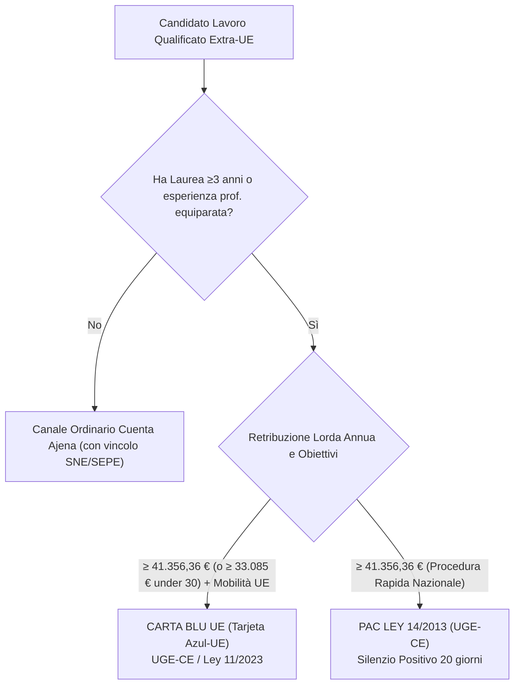
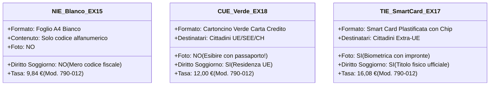

# Guida Ufficiale Visti e Immigrazione: Spagna (ES)

> **Regola di integrità:** Questo documento è l'**UNICA fonte di verità** del progetto Admetia per le normative di ingresso, soggiorno, studio, ricerca, tirocinio, lavoro, fiscalità degli impatriati ed emigrazione in Spagna. Ogni dato numerico, soglia salariale, tariffa o requisito amministrativo reca un riferimento `[ES-SRC-XX]` puntualmente verificato e censito nel file [`spain_sources.md`](spain_sources.md). Le questioni aperte, i contenziosi interpretativi e i punti di monitoraggio manuale sono registrati in [`spain_open_questions.md`](spain_open_questions.md).

---

## 1. Architettura Giuridica ed Enti Competenti

### 1.1 Quadro Normativo Cardine
1. **Real Decreto 1155/2024, de 19 de noviembre** (*Reglamento de la Ley Orgánica 4/2000 sobre derechos y libertades de los extranjeros en España y su integración social*, BOE-A-2024-24099) `[ES-SRC-01]`: Nuovo testo unico dell'immigrazione generale, in vigore dal **20 maggio 2025** (modificato e perfezionato dal *Real Decreto 316/2026, de 14 de abril* `[ES-SRC-30]`). Ha abrogato il previgente RD 557/2011, introducendo la liberalizzazione del lavoro per studenti universitari a 30 ore, l'eliminazione del vincolo dei 3 anni per la transizione studio-lavoro (art. 190), la riforma organica degli Arraigos e l'estensione dei rinnovi di residenza ordinari a 4 anni.
2. **Ley Orgánica 4/2000, de 11 de enero (LOEX consolidata)** `[ES-SRC-02]`: Legge quadro su diritti e doveri degli stranieri in Spagna (residenza temporanea, autorizzazioni di lavoro, residenza di lunga durata dopo 5 anni).
3. **Ley 14/2013, de 27 de septiembre, de apoyo a los emprendedores y su internacionalización** (mod. *Ley 28/2022 de Startups* e *Ley 11/2023*) `[ES-SRC-03]`: Canale rapido gestito dalla UGE-CE per investitori, imprenditori, Professionisti Altamente Qualificati (PAC), ricercatori (art. 72), telelavoratori nomadi digitali (art. 74 bis), tirocini (DA 18ª) e soggiorno per ricerca lavoro post-laurea (**12 mesi improrrogabili** ex DA 17ª).
4. **Real Decreto 240/2007, de 16 de febrero** `[ES-SRC-04]`: Disciplina organica della libera circolazione per cittadini dell'Unione Europea, Spazio Economico Europeo e Svizzera (obbligo di registrazione al *Registro Central de Extranjeros* e rilascio del *Certificado de Registro de Ciudadano de la Unión* - CUE oltre i 90 giorni). Integrato dall'*Orden PRE/1490/2012* `[ES-SRC-05]` sui requisiti economici e sanitari.
5. **Real Decreto 126/2026, de 18 de febrero** `[ES-SRC-06]`: Fissazione del Salario Mínimo Interprofesional (SMI 2026) a **1.221,00 € / mese** in 14 mensilità (**1.424,50 € / mese** in 12 mensilità) = **17.094,00 € lordi/anno** (40,70 €/giorno).
6. **Ley 31/2022 (LPGE prorogata 2024–2026 ex art. 134.4 CE)** `[ES-SRC-07]`: Fissazione dell'Indicador Público de Renta de Efectos Múltiples (IPREM 2026) a **600,00 € / mese** (**7.200,00 € annui su 12 mensilità**; 8.400,00 € su 14 mensilità). Parametro cardine di sussistenza per visti studio e residenze no lucrative.
7. **Ley 35/2006, art. 93 (LIRPF - "Legge Beckham", mod. Ley 28/2022)** `[ES-SRC-08]`: Regime speciale per lavoratori impatriati: aliquota fissa al 24% sui primi 600.000 € di reddito da lavoro dipendente per 6 periodi d'imposta (anno di arrivo + 5 anni). Richiede 5 anni senza residenza fiscale pregressa e nesso causale di trasferimento contrattuale.
8. **Ley 11/2023, de 8 de mayo** `[ES-SRC-09]`: Recepimento della Direttiva (UE) 2021/1883 sulla Carta Blu UE in Spagna (soglia ordinaria 2026: **41.356,36 € lordi/anno**; ridotta a **33.085,09 €** per professioni carenti e giovani laureati entro 3 anni) `[ES-SRC-10]`.

### 1.2 Mappa degli Enti e Portali Competenti
* **Visti Consolari all'Estero:** *Ministerio de Asuntos Exteriores, Unión Europea y Cooperación (MAEC)* tramite consolati generali e centri esternalizzati BLS International `[ES-SRC-14]`.
* **Immigrazione Generale e Uffici Territoriali:** *Ministerio de Política Territorial y Memoria Democrática* — Oficinas de Extranjería presso le Delegaciones del Gobierno `[ES-SRC-12]`.
* **Mobilità Internazionale e Grandi Imprese:** *Ministerio de Inclusión, Seguridad Social y Migraciones* — **UGE-CE** (*Unidad de Grandes Empresas y Colectivos Estratégicos*, `inclusion.gob.es`) `[ES-SRC-03]`, `[ES-SRC-10]`.
* **Polizia di Frontiera e Identificazione Biometrica:** *Dirección General de la Policía (Policía Nacional)* — rilascio CUE (foglio verde comunitari) e TIE (smart card biometrica extra-UE) `[ES-SRC-11]`.
* **Previdenza Sociale e Lavoro:** *Tesorería General de la Seguridad Social (TGSS)* — portale *Import@ss* (`importass.seg-social.gob.es`) per assegnazione NUSS `[ES-SRC-26]`.
* **Anagrafe Comunale:** *Ayuntamiento* del comune di dimora abituale (iscrizione al *Padrón Municipal*) `[ES-SRC-20]`.
* **Fisco e Identificativo Tributario:** *Agencia Estatal de Administración Tributaria (AEAT)* — gestione NIE fiscale, Modello 030 e Regime Beckham (Modello 149) `[ES-SRC-08]`.
* **Sanità Pubblica:** *Sistema Nacional de Salud (SNS)* — Centri di assistenza primaria (CAP/Centros de Salud) autonomici `[ES-SRC-22]`.

---

## 2. Matrice dei Casi d'Uso (Dettaglio Operativo UE vs Extra-UE)

---

### Caso 1: Lavoro Dipendente Ordinario (Cuenta Ajena)

#### Cittadini UE / SEE / Svizzeri
* **Regime Giuridico:** Libera circolazione e accesso immediato al lavoro dipendente senza permessi né quote ex art. 45 TFUE e RD 240/2007 `[ES-SRC-04]`.
* **Ingresso e Soggiorno fino a 3 Mesi:** Libero con passaporto o carta d'identità nazionale valida `[ES-SRC-04]`.
* **Soggiorno oltre 3 Mesi (Obbligo CUE):** Obbligo di richiedere entro 3 mesi il **Certificado de Registro de Ciudadano de la Unión (CUE)** presso la Comisaría de Policía / Oficina de Extranjería provinciale (Modello **EX-18**, Tasa 790-012 di **12,00 €**) `[ES-SRC-04]`, `[ES-SRC-11]`.
* **Documenti per CUE Lavoratore Dipendente:** Documento d'identità UE; dichiarazione di assunzione dell'azienda o copia del contratto di lavoro registrato al SEPE; ricevuta di *alta* telematica nella Seguridad Social `[ES-SRC-04]`; certificato di *Empadronamiento* `[ES-SRC-20]`.
* **Disinnesco del "Comma 22":** Vedere l'algoritmo in 5 step descritto nella Sezione 5.

#### Cittadini Extra-UE
* **Visto Consolare:** *Visado de residencia y trabajo por cuenta ajena* (Visto Tipo D) `[ES-SRC-01]`, `[ES-SRC-14]`. Tariffa consolare: **80,00 €** `[ES-SRC-14]`.
* **Titolo all'Arrivo:** **TIE (Tarjeta de Identidad de Extranjero)** recante l'*Autorización inicial de residencia y trabajo por cuenta ajena* `[ES-SRC-01]`. Costo TIE: **16,08 €** (Tasa 790-012) `[ES-SRC-11]`.
* **Durata e Rinnovi (RD 1155/2024):**
  - Prima concessione: **1 anno** `[ES-SRC-01]`.
  - **Novità RD 1155/2024:** Il primo rinnovo ha validità diretta di **4 anni** (superata la vecchia scansione biennale 1+2+2). Al 5° anno continuativo si accede alla *Residencia de Larga Duración* (indeterminata) `[ES-SRC-01]`, `[ES-SRC-02]`.
* **Filtro Situación Nacional de Empleo (SNE):** Rigido vincolo di mercato. L'assunzione dall'estero è ammessa solo se:
  1. La mansione rientra nel *Catálogo de Ocupaciones de Difícil Cobertura* pubblicato dal SEPE; OPPURE
  2. L'azienda ottiene il *Certificato Negativo del SEPE* (nessun candidato residente idoneo dopo pubblicazione dell'offerta); OPPURE
  3. Il lavoratore rientra nelle deroghe dell'art. 40 LOEX (figli/coniugi di residenti, titolari di autorizzazioni specifiche, cittadini cileni/peruviani ex trattati) `[ES-SRC-02]`.
* **Requisiti Contrattuali e Retributivi Minimi:**
  - Contratto a tempo pieno di durata non inferiore a 1 anno `[ES-SRC-01]`.
  - Retribuzione non inferiore al CCNL applicabile e comunque mai inferiore all'SMI 2026: **1.221,00 € / mese** in 14 paghe = **17.094,00 € lordi/anno** `[ES-SRC-06]`.
  - Solvibilità aziendale comprovata (modelli fiscali 200/303 e regolarità contributiva TGSS/AEAT) `[ES-SRC-01]`.
* **Costi a Carico del Datore di Lavoro:**
  - Tasa 790-062: **203,84 €** (retribuzione < 2× SMI, ossia < 34.188 €/anno) oppure **407,71 €** (retribuzione ≥ 2× SMI) `[ES-SRC-13]`.
* **Procedura Passo-Passo:**
  1. *Fase Spagna (Datore):* Deposito telematico istanza all'Oficina de Extranjería su *Mercurio* con contratto e prova SNE. Pagamento Tasa 790-062 `[ES-SRC-13]`.
  2. *Fase Estero (Lavoratore):* Notificata la concessione, il lavoratore ha 1 mese per richiedere il visto D al Consolato/BLS (casellario giudiziale apostillato valido max 90 gg, certificato medico con dicitura RSI-2005) `[ES-SRC-14]`. Ritiro visto (validità 90 giorni).
  3. *Arrivo e Attivazione:* Ingresso in Spagna. Entro 3 mesi dall'ingresso, il datore deve formalizzare l'**alta alla Seguridad Social**: solo con l'alta l'autorizzazione di residenza acquista piena efficacia giuridica `[ES-SRC-01]`.
  4. *Toma de Huellas (TIE):* Entro 30 giorni dall'alta, il lavoratore richiede l'appuntamento per impronte TIE (Mod. EX-17 + Tasa 790-012 di 16,08 €) `[ES-SRC-11]`.
* **Tempi:** De jure 3 mesi (istruttoria) + 1 mese (visto). De facto: 4–8 mesi totali.
* **Errori Comuni:** Iniziare la prestazione lavorativa prima dell'alta alla TGSS (sanzioni gravi LISOS per il datore e revoca visto); ritardo dell'alta oltre i 3 mesi dall'arrivo (decadenza del titolo ed espulsione).

---

### Caso 2: Lavoro Altamente Qualificato / Skilled (Carta Blu UE vs PAC Ley 14/2013)

La Spagna offre due canali skilled paralleli, entrambi esenti dal test sul mercato del lavoro (SNE) e istruiti per via telematica:

#### 1. Carta Blu UE / Tarjeta Azul-UE (Ley 11/2023 & RD 1155/2024) `[ES-SRC-09]`, `[ES-SRC-10]`
* **Inquadramento:** Recepimento organico della Direttiva (UE) 2021/1883 tramite Ley 11/2023 e artt. 71 bis e ss. della Ley 14/2013.
* **Competenza:** UGE-CE (Unidad de Grandes Empresas y Colectivos Estratégicos).
* **Requisiti Professionali:** Titolo di istruzione superiore terziaria di durata minima di 3 anni (Livello MECES 2 / EQF 6 o superiore); OPPURE esperienza professionale certificata di almeno **5 anni** comparabile (ridotta a **3 anni negli ultimi 7 anni per dirigenti e professionisti ICT**) `[ES-SRC-09]`.
* **Requisiti Contrattuali e Soglie Salariali 2026:**
  - Contratto di lavoro o promessa vincolante di almeno **6 mesi** `[ES-SRC-09]`.
  - **Soglia Salariale Ordinaria (1,4× salario medio INE):** **41.356,36 € lordi annui** (2.954,03 €/mese su 14 mensilità) `[ES-SRC-10]`.
  - **Soglia Salariale Ridotta (0,8× della soglia ordinaria = 1,0× salario medio):** **33.085,09 € lordi annui** (2.363,22 €/mese su 14 mensilità) `[ES-SRC-10]`. Applicabile tassativamente a:
    1. Professioni appartenenti ai Gruppi 1 e 2 della CNO-2011 classificate come ad alta carenza di personale (ICT, ingegneria, sanità);
    2. Giovani laureati che abbiano conseguito il titolo universitario da non più di **3 anni** (o età inferiore a 30 anni).
* **Vantaggi Chiave:** Diritto di mobilità lavorativa semplificata verso un secondo Stato membro UE dopo soli **12 mesi** di soggiorno legale con Carta Blu in Spagna; ricongiungimento familiare simultaneo con autorizzazione lavorativa automatica per il coniuge.
* **Durata Titolo:** **3 anni** (o durata del contratto + 3 mesi se a termine) `[ES-SRC-09]`.
* **Costi e Tempi:** Tasa 790-038 (~**73,26 €**) + Tasa 790-012 TIE (**16,08 €**) `[ES-SRC-11]`. Delibera entro **20 giorni lavorativi (silenzio positivo)** `[ES-SRC-03]`.

#### 2. Autorizzazione Professionisti Altamente Qualificati (PAC - Ley 14/2013) `[ES-SRC-03]`, `[ES-SRC-10]`
* **Inquadramento:** Canale nazionale di mobilità internazionale gestito dalla UGE-CE ex art. 71 Ley 14/2013.
* **Destinatari:** Personale direttivo, manager e specialisti tecnici assunti da grandi imprese, PMI strategiche o titolari di master/dottorati.
* **Soglia Retributiva Applicata dalla UGE-CE (2026):** **41.356,36 € lordi annui** unificata `[ES-SRC-10]`. Parametri di prassi DGM: dirigenti Grupo 1 CNO ~**54.142 €**; specialisti Grupo 2 CNO ~**40.077 €** (allineati al minimo di 41.356,36 €). Ammessa riduzione fino al 25% (~**30.058 €**) per PMI/startup innovative o under 30.
* **Durata Titolo:** **3 anni** se richiesto direttamente in Spagna (dalla situazione di soggiorno legale); **1 anno** se richiesto via visto consolare estero `[ES-SRC-03]`.
* **Tempi di Delibera:** **20 giorni lavorativi con silenzio amministrativo POSITIVO** (art. 76.1 Ley 14/2013) `[ES-SRC-03]`.
* **Errori Comuni:** Computare bonus variabili o retribuzioni in natura non garantite per raggiungere la soglia di 41.356,36 €: la UGE-CE valuta solo la retribuzione fissa di base.

---

### Caso 3: Internship / Tirocinio (Curriculare vs Extracurriculare)

#### A. Tirocinio Curriculare per Studenti Iscritti
* **Base Giuridica:** *Real Decreto 592/2014* `[ES-SRC-15]` e *Convenio de Cooperación Educativa*. Integrato nel piano accademico con riconoscimento crediti ECTS.
* **Cittadini UE ed Extra-UE:** Pienamente coperto dallo statuto di studente e dalla *Estancia por estudios*. **Non richiede alcuna autorizzazione al lavoro separata né visto addizionale** `[ES-SRC-15]`.
* **Obbligo Previdenziale Tassativo (DA 52ª LGSS):** Dal 1° gennaio 2024 è **obbligatoria l'iscrizione alla Seguridad Social (NUSS) e la contribuzione aziendale anche per tirocini NON retribuiti** (con sgravio statale del 95%) `[ES-SRC-16]`. Lo studente deve ottenere il proprio NUSS su *Import@ss* prima del primo giorno di stage `[ES-SRC-26]`.

#### B. Tirocinio Extracurriculare per Studenti Iscritti
* Regolato da convenzione universitaria. Non richiede modifica del permesso di studio, purché le ore non superino i massimali didattici dell'ateneo (max 50% dell'anno accademico in ore di stage, indicativamente 750–900 ore). Indennità mensile di borsa concordata tra le parti; obbligo NUSS `[ES-SRC-16]`.

#### C. Tirocinio Post-Laurea / Professionale (DA 18ª Ley 14/2013) `[ES-SRC-03]`
* **Destinatari:** Stranieri che abbiano conseguito una laurea/master nei **2 anni precedenti** alla richiesta (in Spagna o all'estero) o che stiano frequentando studi superiori terziari.
* **Due Strumenti Contrattuali:**
  1. *Convenio de Prácticas:* Convenzione trilaterale non lavorativa. Durata: **6 mesi prorogabili a 1 anno**. Compenso minimo: almeno pari al 100% IPREM (**600,00 € / mese**) `[ES-SRC-07]`.
  2. *Contratto di Lavoro Formativo per Pratica Professionale (art. 11.3 ET):* Vero contratto di lavoro subordinato. Durata da 6 mesi a **1 anno** (max 2 anni). Retribuzione: non inferiore all'SMI pro-rata (**1.221,00 € / mese**) `[ES-SRC-06]` o alla tabella del CCNL.
* **Istruttoria:** Istanza telematica dell'ente ospitante all'Oficina de Extranjería / UGE-CE. Termine: **30 giorni con silenzio positivo**. Costo: Tasa 790-052 (**10,94 €**) `[ES-SRC-12]` + TIE (**16,08 €**) `[ES-SRC-11]`.

---

### Caso 4: Studio Universitario (Grado / Máster Ufficiale / Título Propio)

#### A. Inquadramento dei Titoli Accademici
* **Grado Universitario (EQF 6):** Titolo ufficiale EEES (240 ECTS, 4 anni).
* **Máster Universitario Oficial (EQF 7):** Registrato al RUCT e verificato da ANECA (60–120 ECTS). Abilita a Dottorato, ricerca lavoro ex DA 17ª e conversione art. 190.
* **Título Propio / Máster de Formación Permanente (RD 822/2021):** Titolo autonomo dell'università. Consente di ottenere la *Estancia por estudios*, ma non dà accesso a Dottorato né crediti ufficiali EEES.

#### B. Regime di Ingresso e Soggiorno Extra-UE
* **Doppia Modalità di Domanda:**
  1. *Dall'Estero:* Domanda di visto nazionale Tipo D presso Consolato spagnolo / BLS `[ES-SRC-14]`. Termine: 1 mese (silenzio negativo).
  2. *Dalla Spagna (In-Country Application):* Presentazione telematica all'Oficina de Extranjería durante i **primi 60 giorni naturali** di ingresso legale (es. con visto turistico Schengen C o esenzione visti), purché manchino almeno 30 giorni alla scadenza del soggiorno legale (art. 54 RD 1155/2024 / art. 39 bis LOEX) `[ES-SRC-01]`, `[ES-SRC-02]`.
* **Requisiti Economici (Proof of Funds 2026) `[ES-SRC-07]`:**
  - **100% IPREM mensile per lo studente:** **600,00 € / mese** (**7.200,00 € per anno accademico di 12 mesi**).
  - *Familiari al seguito:* 75% IPREM per il primo familiare (**450,00 € / mese** = 5.400 €/anno); 50% IPREM per ogni familiare successivo (**300,00 € / mese** = 3.600 €/anno).
  - *Abbattimento alloggio:* Se l'alloggio è prepagato per l'intero soggiorno, la soglia scende al 50% IPREM (300 €/m = 3.600 €/anno).
  - *Prova fondi rigorosa:* Estratti conto bancari degli ultimi 6 mesi; mai versamenti unici repentini non giustificati da atti notarili o buste paga.
* **Lavoro Durante lo Studio (RD 1155/2024 art. 52.1.a e art. 57) `[ES-SRC-01]`:**
  - Gli studenti di istruzione superiore universitaria sono **AUTOMATICAMENTE ABILITATI A LAVORARE FINO A 30 ORE SETTIMANALI** per conto terzi o in proprio. Non è richiesta alcuna autorizzazione amministrativa preventiva: l'azienda effettua direttamente l'alta alla TGSS.
* **Assicurazione Sanitaria Tassativa `[ES-SRC-05]`:** Polizza privata con compagnia autorizzata in Spagna (Sanitas, Adeslas, ASISA, DKV), con clausole testuali espresse: **"Sin copagos, sin periodos de carencia, cobertura completa equivalente al SNS y con repatriación incluida"**. Rifiuto nel 100% dei casi per polizze di viaggio standard.
* **Rinnovo (Prórroga de Estancia):** Tasa 790-052 (**17,49 €**) `[ES-SRC-12]`. Requisito didattico: superamento di almeno il **50% degli esami/crediti** dell'anno accademico precedente.

---

### Caso 5: Tesi / Ricerca all'Estero (Visiting Student vs Ricercatore Art. 72 Ley 14/2013)

#### A. Visiting Student per Preparazione Tesi
* Studente iscritto all'estero ospitato per tesi/ricerca non retribuita:
  - Soggiorno ≤ 90 giorni: Visto Schengen C o esenzione visti, con lettera di invito formale del dipartimento spagnolo ospitante.
  - Soggiorno > 90 giorni: *Autorización de estancia por estudios* basata su convenzione inter-universitaria. Nessun contratto di lavoro; sussistenza garantita da borse estere o 100% IPREM (**600 €/mese**) `[ES-SRC-07]`.

#### B. Ricercatore Scientifico con Convenio de Acogida (Art. 72 Ley 14/2013) `[ES-SRC-03]`
* **Destinatari:** Dottori di ricerca o ricercatori invitati da Università, Centri di ricerca pubblici (CSIC/OPI) o centri R&D aziendali.
* **Documento Cardine:** Il **Convenio de Acogida** (Hosting Agreement) stipulato dall'ente accreditato, attestante il progetto scientifico, le risorse finanziarie (retribuzione o borsa di ricerca) e la copertura previdenziale/sanitaria.
* **Procedura e Vantaggi:**
  - Domanda presentata dall'ente ospitante alla **UGE-CE** per via telematica.
  - Risoluzione in **20 giorni lavorativi con silenzio amministrativo POSITIVO** `[ES-SRC-03]`.
  - Durata: fino a **3 anni** (o durata del progetto). Rilascia una vera e propria autorizzazione di residenza (valida ai fini del quinquennio per la cittadinanza spagnola!).
  - Ricongiungimento simultaneo della famiglia con immediato accesso al lavoro per il coniuge.

---

### Caso 6: Erasmus+ e Mobilità Intra-UE (Direttiva 2016/801)

#### A. Studenti e Docenti UE
* Regime di libera circolazione. Oltre i 3 mesi: rilascio del CUE (foglio verde EX-18) `[ES-SRC-04]`.
* Copertura sanitaria garantita dalla **Tessera Sanitaria Europea (TEAM / TSE)** per l'intera durata della mobilità Erasmus+.

#### B. Studenti Extra-UE con Permesso Studio in Altro Stato Membro UE `[ES-SRC-19]`
* **Mobilità Intra-UE fino a 360 Giorni (Direttiva UE 2016/801 / Art. 59 RD 1155/2024):**
  - Lo studente extra-UE regolarmente soggiornante per studio in uno Stato UE (es. Francia, Italia, Germania) inserito in mobilità Erasmus+ o convenzione atenei **NON DEVE RICHIEDERE ALCUN VISTO CONSOLARE SPAGNOLO**!
* **Procedura Passo-Passo (Comunicación de Movilidad):**
  1. L'università spagnola di destinazione trasmette la *Comunicación de Movilidad Intra-UE* all'Oficina de Extranjería prima dell'ingresso o entro i primi **30 giorni** dall'arrivo dello studente `[ES-SRC-19]`.
  2. Allegati: passaporto, permesso di soggiorno dello Stato UE in corso di validità (deve coprire l'intera mobilità), accordo Erasmus e assicurazione sanitaria.
  3. L'Ufficio Stranieri ha **30 giorni per opporsi**. In assenza di diniego, la mobilità è autorizzata fino a **360 giorni**.
  4. Per soggiorni > 6 mesi, lo studente richiede la TIE presso la Polizia esibendo la comunicazione non opposta `[ES-SRC-11]`.

---

### Caso 7: Master e Dottorato di Ricerca (PhD)

#### A. Master Universitario
* Frequenza coperta da *Estancia por estudios*. Al conseguimento del titolo ufficiale, accesso al canale di ricerca lavoro DA 17ª (12 mesi) o modifica diretta a lavoro ex art. 190.

#### B. Dottorato di Ricerca (PhD) – La Svolta del Criterio de Gestión 2/2026
* **Canale 1: Contratto Predottorale EPI (Personal Investigador en Formación)**
  - *Normativa:* Art. 21 Ley 14/2011 de la Ciencia `[ES-SRC-17]` e RD 103/2019.
  - *Inquadramento Lavorativo:* Contratto di lavoro a termine a tempo pieno (4 anni max). Retribuzione CCNL garantita: 1°/2° anno min 56% CCNL, 3° anno 60%, 4° anno 75% (generalmente **17.500 € – 21.000 € lordi/anno**, ampiamente sopra l'SMI). Piena iscrizione alla Seguridad Social e ritenute IRPF.
* **Canale 2: Borsa di Dottorato Esente (Beca de Investigación)**
  - Esenzione fiscale totale ex art. 7.j LIRPF `[ES-SRC-08]`. Obbligo di cotización previdenziale a fini pensionistici ex DA 52ª LGSS `[ES-SRC-16]`.
* **SVILUPPO MIGRATORIO FONDAMENTALE (Criterio de Gestión 2/2026 DGGM - Agosto 2026) `[ES-SRC-18]`:**
  - I dottorandi extra-UE con contratto predottorale EPI o borsa con Convenio de Acogida **NON RICHIEDONO PIÙ IL VISTO PER STUDIO (Estancia por estudios)**.
  - Vengono incardinati direttamente come **Ricercatori ex art. 72 Ley 14/2013** presso la **UGE-CE**. Risoluzione in **20 giorni lavorativi con silenzio positivo**. Ottengono un titolo di residenza (computabile per la nazionalità spagnola) e ricongiungimento familiare con diritto di lavoro per il coniuge.

---

### Caso 8: Working Holiday / Vacanza-Lavoro (Accordi Bilaterali Spagna)

* **Paesi Convenzionati con la Spagna `[ES-SRC-24]`:**
  1. **Australia** (Accordo Work and Holiday)
  2. **Canada** (Programma International Experience Canada - IEC)
  3. **Nuova Zelanda** (Working Holiday Scheme)
  4. **Giappone** (Accordo Vacaciones y Trabajo)
  5. **Corea del Sud** (Accordo Movilidad de Jóvenes)
* **Requisiti Anagrafici e Durata:**
  - Età: **18–30 anni compiuti** al momento della richiesta (**18–35 anni per cittadini canadesi**) `[ES-SRC-24]`.
  - Durata massima del visto: **12 mesi** non prorogabili.
  - Finalità: Vacanza culturale con facoltà di lavoro accessorio.
* **Limiti Lavorativi e Divieti Tassativi:**
  - Limite di prestazione: massimo **6 mesi con lo stesso datore di lavoro** (salvo specifiche flessibilità canadesi) `[ES-SRC-24]`.
  - Obbligo di NIE e NUSS prima dell'inizio del lavoro.
  - **Divieto di Conversione in Loco:** Il visto Working Holiday **non è direttamente convertibile** in residenza e lavoro in Spagna: al termine dei 12 mesi il titolare deve rientrare nel Paese d'origine `[ES-SRC-24]`.

---

### Caso 9: Post-Study Work / Ricerca Lavoro o Imprenditorialità

La Spagna presenta due percorsi post-laurea alternativi e tra i più rapidi d'Europa:

| Canale Post-Studio | Strumento Giuridico | Durata del Titolo | Requisito Contrattuale Iniziale | Abilitazione al Lavoro Immediata | Ente Competente |
| :--- | :--- | :---: | :---: | :---: | :---: |
| **Opzione A: Ricerca Lavoro / Startup** | Ley 14/2013, DA 17ª `[ES-SRC-03]` | **12 mesi improrrogabili** | Nessuno (si cerca lavoro o si redige business plan) | No (sola residenza; si lavora dopo la modifica) | **UGE-CE** (20 giorni, silenzio positivo) |
| **Opzione B: Modifica Diretta a Lavoro** | RD 1155/2024, art. 190 `[ES-SRC-01]`, `[ES-SRC-30]` | **1 anno** (rinnovo a 4 anni) | Offerta/contratto di lavoro formalizzato (≥ SMI) | **Sì (Habilitación provisional a tempo pieno)** | **Oficina de Extranjería** |

#### Dettagli Operativi Opzione A (DA 17ª Ley 14/2013) `[ES-SRC-03]`
* Requisito: Titolo di livello MECES 2/3/4 (Laurea, Master Ufficiale o Dottorato) conseguito in Spagna.
* Finestra di deposito: Da **60 giorni naturali prima** a **90 giorni naturali dopo** la scadenza dell'autorizzazione di studio.
* Mezzi economici: 100% IPREM mensile (**600,00 € / mese** per i 12 mesi = 7.200 €) `[ES-SRC-07]` e assicurazione sanitaria privata sin copagos.
* Al reperimento del lavoro: Modifica diretta in PAC (Ley 14/2013) o Cuenta Ajena ordinaria **esente da test di mercato del lavoro (SNE)**!

#### Dettagli Operativi Opzione B (Art. 190 RD 1155/2024) `[ES-SRC-01]`, `[ES-SRC-30]`
* **Abolizione del vincolo dei 3 anni:** Non è richiesta alcuna permanenza triennale pregressa in Spagna; è sufficiente aver concluso con profitto il ciclo di studi superiori.
* **Habilitación Provisional al Lavoro:** Depositata l'istanza su Mercurio con il contratto, il neolaureato riceve la ricevuta con **autorizzazione provvisoria al lavoro a tempo pieno** che gli consente di lavorare legalmente già durante l'istruttoria!

---

### Caso 10: Soggiorni Brevi (≤90 gg) e Ricongiungimento Familiare

#### A. Soggiorni Brevi (≤ 90 giorni su 180 giorni)
* **Requisiti Economici d'Ingresso alla Frontiera (2026) `[ES-SRC-23]`:**
  - Minimo **10% del SMI lordo al giorno per persona** = **122,10 € / giorno**;
  - Importo minimo assoluto garantito per persona (anche per soggiorni di 1-2 giorni): non inferiore al 90% del SMI = **1.098,90 € per persona**.
* **Alloggio:** Prenotazione alberghiera o **Carta de Invitación** ufficiale emessa dalla Policía Nacional su istanza dell'ospitante.
* **Obbligo Tassativo - Declaración de Entrada (Art. 12 RD 1155/2024) `[ES-SRC-01]`:**
  - Chi entra in Spagna con volo avente scalo intermedio in un altro Paese Schengen (senza controllo di frontiera in Spagna) **deve presentarsi entro 72 ore lavorative presso una Comisaría de Policía** per rendere la *Declaración de entrada*, conservando le carte d'imbarco. L'omissione costituisce infrazione amministrativa ed espone a sanzioni e contestazioni sui 30 giorni della TIE!
* **Divieto Assoluto:** Divieto di esercitare attività lavorativa retribuita durante il soggiorno breve.

#### B. Ricongiungimento Familiare (Quattro Regimi Distinti)
1. **Regime Generale (RD 1155/2024 / LOEX artt. 16-19) `[ES-SRC-01]`:**
   - Requisito del Ricongiungente: 1 anno di residenza legale e aver ottenuto o richiesto il rinnovo per il 2° anno. Per ricongiungere i genitori (>65 anni), occorre la *Residencia de Larga Duración* (5 anni).
   - Requisiti Economici: **150% dell'IPREM mensile** per il primo familiare (**900,00 €/mese**) + **50% IPREM** per ogni familiare ulteriore (**300,00 €/mese**) `[ES-SRC-07]`. Idoneità alloggiativa (*Informe de vivienda*) comunale. I familiari ottengono autorizzazione lavorativa automatica.
2. **Regime Comunitario (RD 240/2007) `[ES-SRC-04]`:**
   - Per familiari di cittadini UE/SEE residenti in Spagna: *Tarjeta de Residencia de Familiar de Ciudadano de la Unión* (validità 5 anni). Coniugi, unioni registrate, coppie stabili di fatto conviventi, figli fino a 21 anni e genitori a carico. Accesso immediato e illimitato al lavoro.
3. **Nuovo Statuto Familiari di Cittadini Spagnoli (RD 1155/2024) `[ES-SRC-01]`:**
   - Titolo ad hoc di **5 anni**, superando il vecchio arraigo familiar, con esenzioni da requisiti economici rigidi per figli minori e accesso immediato all'impiego.
4. **Regime Ley 14/2013 (UGE-CE) `[ES-SRC-03]`:**
   - Ricongiungimento simultaneo rapido per familiari di PAC, ricercatori e titolari di Carta Blu UE, con risoluzione telematica in 20 giorni e pieno diritto al lavoro per il coniuge.

---

## 3. Riepilogo Costi Amministrativi Obbligatori per Tipologia

| Procedimento / Titolo | Visto Consolare MAEC | Tasa Extranjería (Mod. 052/062/038) | Tasa Policía TIE / CUE (Mod. 012) | Centro Visti (BLS Fee) | Totale Amministrativo Obbligatorio |
| :--- | :---: | :---: | :---: | :---: | :---: |
| **Cittadino UE (CUE EX-18)** | N/A (Esente) | N/A | **12,00 €** `[ES-SRC-11]` | N/A | **12,00 €** |
| **Estancia por Estudios (Iniziale Estero)** | **80,00 €** `[ES-SRC-14]` | N/A | **16,08 €** `[ES-SRC-11]` | ~**16,50 €** | **112,58 €** *(escl. reciprocità)* |
| **Estancia por Estudios (In-Country)** | N/A | **10,94 €** `[ES-SRC-12]` | **16,08 €** `[ES-SRC-11]` | N/A | **27,02 €** |
| **Proroga Soggiorno Studio** | N/A | **17,49 €** `[ES-SRC-12]` | **19,30 €** `[ES-SRC-11]` | N/A | **36,79 €** |
| **Ricerca Lavoro (DA 17ª Ley 14/2013)** | N/A | ~**73,26 €** (Tasa 038) | **16,08 €** `[ES-SRC-11]` | N/A | **89,34 €** |
| **Lavoro Subordinato Ordinario** | **80,00 €** `[ES-SRC-14]` | **203,84 €** (Datore) `[ES-SRC-13]` | **16,08 €** `[ES-SRC-11]` | ~**16,50 €** | **316,42 €** *(219,92 € datore + 96,50 € lav.)* |
| **Modifica Studio-Lavoro (Art. 190)** | N/A | **203,84 €** (Datore) `[ES-SRC-13]` | **16,08 €** `[ES-SRC-11]` | N/A | **219,92 €** |
| **Carta Blu UE / PAC Ley 14/2013** | **80,00 €** *(se estero)* | ~**73,26 €** (Tasa 038) | **16,08 €** `[ES-SRC-11]` | ~**16,50 €** *(se estero)*| **105,42 €** *(in-country)* / **185,84 €** *(estero)* |
| **Residencia No Lucrativa (1° Anno)** | **80,00 €** `[ES-SRC-14]` | **10,94 €** `[ES-SRC-12]` | **16,08 €** `[ES-SRC-11]` | ~**16,50 €** | **123,52 €** |
| **Residenza Lunga Durata (5 Anni)** | N/A | **21,87 €** `[ES-SRC-12]` | **21,87 €** `[ES-SRC-11]` | N/A | **43,74 €** |

---

## 4. Statuto Giuridico durante l'Attesa e Diritti di Viaggio

### 4.1 La Ricevuta di Deposito (*Resguardo de Solicitud*)
* **Valore Legale:** Il deposito telematico dell'istanza su Mercurio o presso il registro generale rilascia la ricevuta recante codice sicuro di verifica (CSV) e numero di protocollo. Attesta la **regolare pendenza del soggiorno** sul territorio spagnolo ai sensi della Legge 39/2015 e del RD 1155/2024 `[ES-SRC-01]`.
* **Habilitación Provisional al Lavoro:**
  - Nelle istanze di modifica studio-lavoro ex art. 190 RD 1155/2024 `[ES-SRC-01]`, `[ES-SRC-30]`, la ricevuta conferisce ope legis l'**autorizzazione provvisoria a lavorare a tempo pieno** dal momento della sua ammissione a trattazione.
  - Nei rinnovi di autorizzazioni di lavoro già in essere, la ricevuta proroga ope legis la precedente autorizzazione lavorativa fino a decisione definitiva.

### 4.2 Regime Tassativo dei Viaggi all'Estero (*Autorización de Regreso*)
* **Divieto di Espatrio senza Titolo Valido:** Con il permesso scaduto e la sola ricevuta di rinnovo in mano, **NON È PERMESSO VIAGGIARE NELLO SPAZIO SCHENGEN**. Le polizie di frontiera degli altri Paesi UE (es. Francia, Germania, Italia) non riconoscono le ricevute spagnole e considerano il viaggiatore privo di titolo di soggiorno valido!
* **Autorización de Regreso (Art. 5 RD 1155/2024) `[ES-SRC-01]`:**
  - Rilasciata dalla Policía Nacional (Tasa 790-012: ~**10,72 €**).
  - *Condizione Tassativa:* Avere già sostenuto la presa impronte (toma de huellas) ed esibire il *resguardo de solicitud de tarjeta* (o avere una delibera favorevole). Non viene rilasciata se la pratica è ancora in istruttoria preliminare!
  - *Regola di Volo Obbligatoria:* Consente di uscire e rientrare in Spagna **esclusivamente con volo DIRETTO dalla Spagna verso il Paese extra-Schengen d'origine e viceversa**. È tassativamente vietato effettuare scali intermedi in aeroporti Schengen (es. scali a Francoforte, Parigi o Roma), pena il blocco all'imbarco o il respingimento alla frontiera!

---

## 5. Procedure Orizzontali Abilitanti

### 5.1 La Triade Documentale: NIE Blanco vs CUE Verde vs TIE Smart Card

* **Regola del Cartoncino Verde UE:** Non plastificare MAI il CUE verde. La termosaldatura distrugge i dispositivi di sicurezza antifalsificazione e rende il documento nullo `[ES-SRC-04]`. Esibirlo sempre insieme al passaporto o carta d'identità nazionale UE.

### 5.2 Algoritmo in 5 Step per Disinnescare il "Comma 22" (Neoassunti UE)
1. **Step 1 (NUSS con Passaporto):** Richiedere il Número de la Seguridad Social su *Import@ss* (`importass.seg-social.gob.es`) esibendo passaporto/carta d'identità UE `[ES-SRC-26]`.
2. **Step 2 (Empadronamiento con Passaporto):** Iscriversi al Padrón del Comune con il passaporto e contratto d'affitto, opponendo la Risoluzione INE/DGP del 29/04/2020 contro le pretese illegittime di NIE `[ES-SRC-20]`.
3. **Step 3 (Conto Fintech/UE):** Aprire conto con IBAN spagnolo o SEPA basato su passaporto (Regolamento UE 260/2012 anti-IBAN discrimination).
4. **Step 4 (Alta TGSS da parte dell'Azienda):** L'azienda formalizza l'assunzione e l'alta sul NAF emesso con passaporto.
5. **Step 5 (CUE EX-18):** Presentarsi all'appuntamento di Extranjería con passaporto, Padrón e ricevuta di alta TGSS, ritirando a vista il Certificato UE con il NIE definitivo `[ES-SRC-04]`.

### 5.3 Empadronamiento: Iscrizione Anagrafica e Rischio Radiazione
* L'iscrizione è obbligatoria per tutti i residenti. Il *volante de empadronamiento* ha validità consuetudinaria di **3 mesi** per le pratiche di extranjería `[ES-SRC-20]`.
* **Obbligo Rinnovo Biennale Extra-UE:** Gli stranieri extra-UE senza residenza di lunga durata devono rinnovare il padrón **ogni 2 anni**. L'omissione provoca la **cancellazione d'ufficio (Baja de oficio por caducidad)**, interrompendo la continuità utile per i rinnovi e la cittadinanza `[ES-SRC-20]`.

### 5.4 Sanità: Copertura Pubblica vs Convenio Especial vs Assicurazione Privata
* Chi lavora regolarmente, i ricercatori EPI e i tirocinanti (ex DA 52ª LGSS) sono iscritti gratuitamente al SNS e ottengono la Tarjeta Sanitaria Individual (TSI) `[ES-SRC-16]`.
* Chi risiede legalmente senza lavorare e non dispone di polizza privata può accedere al **Convenio Especial de Asistencia Sanitaria (RD 576/2013)** dopo almeno 12 mesi continui di Empadronamiento: costo mensile di **60,00 €** (< 65 anni) o **157,00 €** (≥ 65 anni) `[ES-SRC-22]`.

---

## 6. Allerte di Sicurezza, Mercato Nero e Prevenzione Frodi

> [!CAUTION]
> **Mercato Nero della Cita Previa:** È tassativamente vietato acquistare appuntamenti online da bot o intermediari non autorizzati (€ 50–250). La Polizia verifica la corrispondenza dei dati nominativi all'ingresso: in caso di discordanza l'accesso è negato e si rischiano sanzioni penali ex art. 197 bis CP `[ES-SRC-28]`, `[ES-SRC-29]`. Utilizzare finestre ufficiali (venerdì mattina ore 09:00 a Madrid/Valencia, mercoledì ore 09:30 a Barcellona) o canali Mercurio tramite avvocati/gestori accreditati `[ES-SRC-27]`.

> [!WARNING]
> **Pisos Patera ed Empadronamiento Fittizio:** L'iscrizione anagrafica a indirizzi compiacenti senza effettiva dimora comporta la radiazione anagrafica d'ufficio e l'incriminazione penale per falsità documentale (artt. 390 e 392 CP: reclusione da 6 mesi a 3 anni) con revoca dei titoli ed espulsione `[ES-SRC-29]`.

> [!WARNING]
> **Contratti di Lavoro Simulati:** La presentazione di offerte o contratti di lavoro fittizi per l'ottenimento di visti o Arraigos è punita dall'art. 311 bis del Codice Penale con la reclusione da 1 a 5 anni per i promotori e comporta per il candidato la revoca immediata del titolo, il divieto di reingresso fino a 10 anni e maxisanzioni da 10.001 € a 100.000 € ai sensi della LISOS `[ES-SRC-29]`.

---
*Documento consolidato e verificato dal Council di Verifica Immigrazione Admetia al 05/10/2026.*
