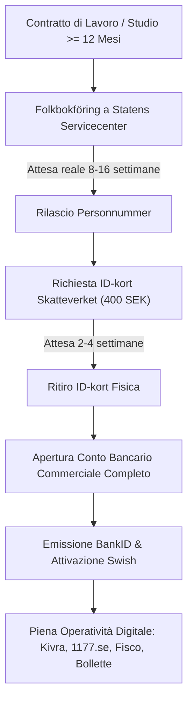

# Guida Ufficiale Visti e Immigrazione: Svezia (*Sverige*)

> **Regola di integrità:** Questo documento costituisce l'**UNICA fonte di verità** del progetto Admetia per il Regno di Svezia (*Konungariket Sverige*). Ogni dato numerico, tariffa, soglia di reddito, termine procedurale o requisito amministrativo reca un riferimento univoco `[ID-fonte]` collegato al registro ufficiale [`sweden_sources.md`](sweden_sources.md). I punti soggetti a divergenza prasseologica o a monitoraggio legislativo sono catalogati in [`sweden_open_questions.md`](sweden_open_questions.md).

---

## 1. Architettura Giuridica ed Enti Competenti

Il sistema dell'immigrazione, del soggiorno e dell'anagrafe del Regno di Svezia è fondato su una rigorosa distinzione tra cittadini comunitari (UE/SEE) e cittadini di Paesi terzi (extra-UE), caratterizzato da un'infrastruttura amministrativa fortemente centralizzata e interamente telematica:

- **Quadro Normativo Cardine:**
  - *Utlänningslagen (SFS 2005:716)* e *Utlänningsförordningen (SFS 2006:97)*: Testo unico sull'immigrazione, ingresso, visti, permessi di lavoro, soggiorno e allontanamento `[SE-SRC-12]`.
  - *Proposition 2025/26:87* e *Betänkande 2025/26:SfU12* (in vigore dal 1° giugno 2026): Riforma organica dell'immigrazione per lavoro qualificato e innalzamento del requisito di autosufficienza (*försörjningskrav*) al 90% della mediana SCB `[SE-SRC-01]`, `[SE-SRC-02]`.
  - *Folkbokföringslagen (SFS 1991:481)*: Disciplina dell'anagrafe della popolazione residente, rilascio del *personnummer* e contrasto penale alle false dichiarazioni di domicilio (*folkbokföringsbrott*) `[SE-SRC-15]`, `[SE-SRC-22]`.
  - *Inkomstskattelagen (SFS 1999:1229)* e legge *SFS 2023:765*: Disciplina delle imposte sul reddito e regime speciale di esenzione per esperti, scienziati e ricercatori esteri (*expertskatt*) esteso a 7 anni `[SE-SRC-14]`.
  - *Direttive UE applicate:* Direttiva 2004/38/CE (Libera circolazione ed esercizio del diritto di soggiorno *uppehållsrätt*); Direttiva (UE) 2016/801 (Studenti e Ricercatori); Direttiva (UE) 2021/1883 (Carta Blu UE, recepita nel capitolo 6a dell'Utlänningslagen) `[SE-SRC-03]`, `[SE-SRC-09]`, `[SE-SRC-15]`.
- **Mappa degli Enti e Portali Competenti:**
  - **Migrationsverket (Agenzia Svedese per la Migrazione - *migrationsverket.se*):** Autorità competente in via esclusiva per il rilascio, la proroga e la revoca dei permessi di soggiorno temporanei (*uppehållstillstånd*), permessi di lavoro (*arbetstillstånd*), permessi UE di lungo periodo e residenza permanente (*permanent uppehållstillstånd* - PUT) `[SE-SRC-11]`.
  - **Skatteverket (Agenzia delle Entrate e Anagrafe - *skatteverket.se*):** Gestione del registro anagrafico della popolazione (*folkbokföring*), attribuzione del codice di identità personale (**personnummer**) e del codice di coordinamento (**samordningsnummer**), emissione della carta d'identità fisica (*ID-kort för folkbokförda*) e gestione dell'imposizione fiscale (*A-skatt* e *SINK*) `[SE-SRC-15]`, `[SE-SRC-16]`, `[SE-SRC-19]`.
  - **Statens servicecenter (*statenssc.se*):** Sportelli fisici territoriali unificati che integrano i servizi front-office di Skatteverket, Försäkringskassan e Arbetsförmedlingen per la verifica documentale *de visu*, richiesta dell'ID-kort e rilascio codici `[SE-SRC-16]`.
  - **Försäkringskassan (Cassa di Previdenza Sociale - *forsakringskassan.se*):** Gestione delle assicurazioni sociali statali, indennità di malattia (*sjukpenning*), infortuni sul lavoro e prestazioni familiari (*barnbidrag*) `[SE-SRC-18]`.
  - **Arbetsförmedlingen (Agenzia Pubblica per il Lavoro - *platsbanken.se*):** Gestione del mercato occupazionale, pubblicazione obbligatoria dei posti vacanti su scala europea (*EURES*) per i permessi di lavoro ordinari `[SE-SRC-12]`.
  - **Forskarskattenämnden (*forskarskattenamnden.se*):** Commissione tributaria preposta alla valutazione e concessione dello sgravio fiscale del 25% per specialisti ed esperti internazionali `[SE-SRC-14]`.
  - **Utrikesdepartementet (Ministero Affari Esteri) & Ambasciate di Svezia (*swedenabroad.se*):** Rete diplomatica estera per la verifica fisica obbligatoria del passaporto originale (*passkontroll*), acquisizione della biometria e apposizione del visto nazionale d'ingresso D (*D-visum*) tramite centri partner VFS Global `[SE-SRC-24]`.
- **Infrastruttura Digitale di Stato:**
  - **BankID (*bankid.com*):** Strumento privato bancario di identità digitale che costituisce il monopolio *de facto* per l'accesso a tutta la pubblica amministrazione telematica, banche, sanità online (*1177.se*) e caselle di posta certificate (*Kivra*) `[SE-SRC-17]`.
  - **Swish:** Piattaforma nazionale di micropagamenti istantanei per smartphone, indispensabile per vivere in una società al 95% *cashless* `[SE-SRC-17]`.

---

## 2. Matrice Completa dei Casi d'Uso (Dettaglio Operativo UE vs Extra-UE)

---

### Caso 1: Lavoro Dipendente Ordinario (General Employment)

#### A. Cittadini UE / SEE / Svizzera (inclusi cittadini italiani)
- **Regime giuridico:** Libera circolazione dei lavoratori (art. 45 TFUE e Direttiva 2004/38/CE).
- **Autorizzazione al lavoro:** Nessun visto né permesso di lavoro richiesto. Il cittadino UE esercita il diritto di soggiorno (*uppehållsrätt*) e può iniziare a lavorare dal primo giorno in Svezia senza alcuna autorizzazione preventiva da parte di Migrationsverket `[SE-SRC-15]`.
- **Abolizione registrazione Migrationsverket:** Dal 1° maggio 2014 i cittadini comunitari **non devono più registrarsi presso Migrationsverket** `[SE-SRC-15]`.
- **Procedura all'arrivo:**
  1. Ingresso sul territorio svedese con passaporto o carta d'identità valida.
  2. Firma del contratto di lavoro (*anställningsavtal*).
  3. Presentazione personale presso uno sportello di *Statens servicecenter / Skatteverket* per l'iscrizione all'anagrafe (*folkbokföring*). Se il contratto ha durata di **almeno 1 anno (12 mesi)**, Skatteverket assegna il **personnummer** a costo **0 SEK** `[SE-SRC-15]`.
  4. Se il contratto dura meno di 12 mesi, Skatteverket assegna un **samordningsnummer** per fini fiscali `[SE-SRC-15]`.

#### B. Cittadini Extra-UE (*Arbetstillstånd*)
- **Regime giuridico:** *Utlänningslagen* 6 kap. 2 § `[SE-SRC-12]` modificato dalla *Proposition 2025/26:87* `[SE-SRC-02]`.
- **Nuova Soglia Salariale Minima (90% della mediana SCB dal 16/06/2026):**
  - La retribuzione lorda mensile deve essere pari ad almeno il **90% del salario mediano svedese** pubblicato da SCB (pari a 38.300 SEK/mese), ossia **almeno 34.470 SEK al mese lordi** (circa 3.064 €) `[SE-SRC-01]`.
  - *Deroga al 75% per professioni in carenza:* La soglia è ridotta al **75% della mediana (28.725 SEK/mese)** esclusivamente per una specifica lista governativa di professioni a forte carenza d'organico (*bristyrken*), per neolaureati in Svezia transitati a lavoro entro 6 mesi e per dipendenti di giovani imprese innovative `[SE-SRC-01]`, `[SE-SRC-02]`.
  - *Clausola transitoria rinnovi:* I lavoratori già titolari di permesso concesso prima del 1° giugno 2026 che chiedono il rinnovo tra il 01/06/2026 e il 01/12/2026 mantengono la previgente soglia dell'80% (**30.640 SEK/mese**) `[SE-SRC-01]`.
- **I Tre Pilastri Obbligatori a Carico del Datore di Lavoro:**
  1. *Test del mercato del lavoro (Annuncio EURES per 10 giorni):* Il posto vacante deve essere stato pubblicato su *Arbetsförmedlingens Platsbanken* e sincronizzato su EURES per almeno **10 giorni di calendario consecutivi** prima della stipula dell'offerta contrattuale. L'omissione costituisce **vizio originario insanabile** (*MIG 2015:11*) che determina il rigetto e l'espulsione senza possibilità di correzione `[SE-SRC-12]`, `[SE-SRC-13]`.
  2. *Parere sindacale preventivo (Fackligt yttrande):* Il datore deve trasmettere le condizioni di lavoro al sindacato svedese competente di settore (es. *Unionen* per impiegati, *Sveriges Ingenjörer* per ingegneri/IT, *Akavia* per economisti). Le condizioni devono rispettare i contratti collettivi svedesi (*kollektivavtal*) `[SE-SRC-06]`, `[SE-SRC-12]`.
  3. *Le 4 Assicurazioni Obbligatorie (Kompetensutvisningar):* Il datore deve garantire attive dal primo giorno: 1) Sjukförsäkring (malattia), 2) Livförsäkring / TGL (vita), 3) Trygghetsförsäkring vid arbetsskada / TFA (infortuni sul lavoro), 4) Tjänstepension / ITP (previdenza complementare). Se un datore privo di contratto collettivo stipula polizze incomplete o presenta buchi contributivi non sanati prima dei controlli, Migrationsverket respinge il rinnovo (*MIG 2017:24*) `[SE-SRC-13]`.
- **Procedura passo-passo prima dell'arrivo:**
  1. Il datore svedese avvia l'offerta (*anställningserbjudande*) sul portale e-service di Migrationsverket e acquisisce il parere sindacale `[SE-SRC-12]`.
  2. Il lavoratore riceve il link di invito telematico, carica i documenti personali e paga la tassa amministrativa di **2.200 SEK** `[SE-SRC-11]`.
  3. *Verifica del passaporto (Passkontroll):*
     - I cittadini di Paesi esenti da visto Schengen con passaporto biometrico (es. USA, UK, Canada, Australia) possono completare la verifica biometrica digitale tramite l'app per smartphone **Freja eID** `[SE-SRC-24]`.
     - I cittadini di Paesi con obbligo di visto (es. India, Cina, Paesi terzi non esenti) devono **presentarsi fisicamente di persona** con il passaporto originale presso l'Ambasciata o Consolato Generale di Svezia all'estero per l'identificazione e la biometria `[SE-SRC-24]`.
  4. Migrationsverket delibera la concessione (*beslut*). I richiedenti visa-required ricevono la carta di soggiorno plastificata (*Uppehållstillståndskort* - UT-kort) prima di viaggiare. I visa-exempt possono viaggiare con la sola lettera di approvazione e acquisire la foto/impronte in Svezia `[SE-SRC-24]`.
- **Costi obbligatori 2026:**
  - Tassa Migrationsverket prima domanda: **2.200 SEK** (~195,56 €) `[SE-SRC-11]`.
  - Tassa proroga/rinnovo: **2.200 SEK** (~195,56 €) per il lavoratore dipendente; 1.500 SEK per i familiari adulti e 750 SEK per i minori `[SE-SRC-11]` *(verificato 06/10/2026 su migrationsverket.se; la guida riportava 1.500 SEK)*.
  - Coniuge al seguito: 1.500 SEK; Minori al seguito: 750 SEK `[SE-SRC-11]`.
- **Tempi di lavorazione:**
  - Kategori A (Manager, Professionisti SSYK 1-3 con domanda digitale completa): target di **30 giorni** (tempi reali 18-35 giorni) `[SE-SRC-02]`.
  - Kategori B-C (altre professioni o verifiche documentali): 2-6 mesi; domande cartacee incomplete: fino a 10-12 mesi.
- **Regole di rinnovo e accesso a Residenza Permanente (PUT):**
  - Il primo permesso è concesso per massimo 2 anni ed è vincolato sia allo specifico datore che alla specifica professione (*yrke*). Dopo 2 anni di rinnovo, è vincolato solo alla professione `[SE-SRC-12]`.
  - **Accesso al PUT (Permanent Uppehållstillstånd):** Concedibile dopo aver completato **4 anni (48 mesi)** di permesso di lavoro negli ultimi 7 anni. Requisito tassativo (*försörjningskrav* ex SFS 2021:765): disporre al momento della decisione di un contratto di lavoro stabile di durata residua di almeno **18 mesi** e soddisfare i requisiti di onorabilità (*vandelskrav*) `[SE-SRC-07]`, `[SE-SRC-12]`.

---

### Caso 2: Lavoro Altamente Qualificato / Skilled (Carta Blu UE - *EU-blåkort*)

#### A. Cittadini UE / SEE / Svizzera
- Non applicabile. Libera circolazione incondizionata a costo 0 SEK `[SE-SRC-15]`.

#### B. Cittadini Extra-UE (*EU-blåkort*)
- **Regime giuridico:** *Utlänningslagen* 6a kap. (recepimento Direttiva UE 2021/1883) `[SE-SRC-03]`.
- **Requisiti soggettivi e oggettivi vigenti al 05/10/2026:**
  - **Soglia salariale minima (1,25 volte lo stipendio medio Medlingsinstitutet):** Almeno **53.625 SEK al mese lordi** (~4.766,67 €; pari a 643.500 SEK/anno) `[SE-SRC-03]`. *(Nota: la legge svedese applica il moltiplicatore ridotto di 1,25x e non 1,5x)*.
  - **Durata contrattuale minima:** Contratto di lavoro o offerta vincolante per impiego altamente qualificato di durata di **almeno 6 mesi** (ridotta dal precedente vincolo annuale) `[SE-SRC-03]`.
  - **Titoli formativi o professionali:** Titolo accademico di istruzione superiore di durata almeno triennale (minimo **180 CFU/ECTS**, equivalente a Bachelor o Master) OPPURE almeno **5 anni di comprovata esperienza professionale** specifica nel settore `[SE-SRC-03]`.
  - Annuncio pubblicato su EURES per almeno 10 giorni; consultazione preventiva del sindacato svedese; pacchetto delle 4 assicurazioni obbligatorie a carico del datore `[SE-SRC-03]`.
- **Durata del titolo e vantaggi specifici:**
  - Rilasciato per la durata del contratto più 3 mesi, con un massimo esteso fino a **4 anni** `[SE-SRC-03]`.
  - Mobilità intra-UE agevolata dopo 12 mesi di residenza con Blue Card in Svezia.
  - **Accesso accelerato alla Residenza Permanente (PUT):** Concedibile dopo soli **36 mesi (3 anni)** di soggiorno con Blue Card in Svezia (oppure 24 mesi se integrati con altri periodi Blue Card in altro Stato membro) `[SE-SRC-03]`.
- **Costi e tempi:** Tassa Migrationsverket: **2.200 SEK** sia per la prima domanda sia per la proroga `[SE-SRC-11]`. Tempi di delibera prioritari: 30-60 giorni (massimo statutario UE di 90 giorni).

---

### Caso 3: Internship / Tirocinio (Curriculare vs Extracurriculare)

#### A. Cittadini UE / SEE / Svizzera
- Libero accesso a qualsiasi tirocinio. Se il tirocinio dura meno di 1 anno, lo stagista non ha diritto al personnummer (riceve un *samordningsnummer* se retribuito) e deve garantire la copertura sanitaria mediante la tessera TEAM/EHIC o modello S1 `[SE-SRC-15]`.

#### B. Cittadini Extra-UE: Tre tipologie operative distinte

```
                                  ┌──────────────────────────────────────────────┐
                                  │      TIROCINI PER EXTRA-UE IN SVEZIA         │
                                  └──────────────────────┬───────────────────────┘
                                                         │
                ┌────────────────────────────────────────┼────────────────────────────────────────┐
                ▼                                        ▼                                        ▼
    ┌─────────────────────────┐              ┌─────────────────────────┐              ┌─────────────────────────┐
    │  TIROCINIO CURRICULARE  │              │   ALTA FORMAZIONE (UE)  │              │  AZIENDALE ORDINARIO    │
    │ (Piano di studi Svezia) │              │   (Direttiva 2016/801)  │              │   (Extracurriculare)    │
    ├─────────────────────────┤              ├─────────────────────────┤              ├─────────────────────────┤
    │ • Coperto da visto stud.│              │ • Studenti o neolaureati│              │ • Riqualificato come    │
    │ • ESENTE dal tetto 15h  │              │   entro 2 anni da laurea│              │   lavoro subordinato    │
    │ • Nessun titolo extra   │              │ • Praktikavtal tripartito│              │ • Salario >= 34.470 SEK │
    │ • Tassa: 0 SEK          │              │ • Sussistenza 10.656 SEK│              │ • Tassa: 2.200 SEK      │
    └─────────────────────────┘              └─────────────────────────┘              └─────────────────────────┘
```

1. **Tirocinio Curriculare Integrato (incluso nel programma universitario svedese):**
   - Per studenti extra-UE regolarmente iscritti a un corso di laurea/master in Svezia: il tirocinio curriculare è compreso nel permesso di soggiorno per studio `[SE-SRC-04]`, `[SE-SRC-08]`.
   - **Esenzione Tassativa dal Limite Orario:** Con la riforma dell'11 giugno 2026, il tirocinio curriculare obbligatorio o accreditato nel piano di studi è **espressamente esentato dal tetto delle 15 ore settimanali** e può essere svolto a tempo pieno `[SE-SRC-04]`.
2. **Tirocinio collegato all'Istruzione Superiore (Direttiva UE 2016/801 - *Praktik med anknytning till högre utbildning*):**
   - Riservato a candidati extra-UE che stanno completando studi terziari all'estero o che hanno conseguito la laurea terziaria nei **2 anni precedenti** la domanda `[SE-SRC-08]`.
   - Requisito essenziale: Stipula di una formale convenzione di tirocinio (*Praktikavtal*) contenente piano formativo, obiettivi di apprendimento e tutor aziendale `[SE-SRC-08]`.
   - Requisito finanziario 2026: Almeno **10.656 SEK al mese** (garantiti da borsa di tirocinio, retribuzione aziendale o fondi propri documentati su conto personale) `[SE-SRC-05]`, `[SE-SRC-08]`.
   - Assicurazione sanitaria completa (*heltäckande sjukförsäkring*) valida per l'intero periodo `[SE-SRC-08]`.
   - Durata massima autorizzata: **18 mesi** (non ulteriormente prorogabile) `[SE-SRC-08]`.
   - Tassa Migrationsverket: **1.500 SEK** `[SE-SRC-11]`.
3. **Tirocinio Extracurriculare Aziendale Puro (Non accreditato):**
   - La Svezia **non ammette tirocini aziendali non retribuiti o con rimborsi simbolici** per cittadini extra-UE al di fuori di percorsi universitari riconosciuti.
   - Viene legalmente inquadrato come lavoro subordinato: richiede la procedura ordinaria di *Arbetstillstånd*, con salario minimo di **34.470 SEK/mese**, 10 giorni su EURES, parere sindacale e 4 assicurazioni. Tassa: 2.200 SEK `[SE-SRC-01]`, `[SE-SRC-08]`, `[SE-SRC-11]`.

---

### Caso 4: Studio Universitario (Bachelor / Master / Corsi Accademici)

#### A. Cittadini UE / SEE / Svizzera
- **Corsi accademici gratuiti:** Nessuna retta universitaria (*tuition fee = 0 SEK*) negli atenei statali svedesi.
- **Titolo di soggiorno:** Nessun permesso di soggiorno richiesto. Diritto di soggiorno ex art. 7 Dir. 2004/38/CE come *studerande* `[SE-SRC-15]`.
- **Anagrafe e Personnummer:**
  - *Master biennali (120 CFU / 2 anni):* Diritto all'iscrizione anagrafica a Skatteverket (*folkbokföring*) e rilascio immediato del **personnummer** previa esibizione di: passaporto/carta d'identità, lettera di iscrizione universitaria, dichiarazione di mezzi di sussistenza e copertura sanitaria (TEAM/EHIC con validità estesa) `[SE-SRC-15]`.
  - *Master annuali (60 CFU / 1 anno accademico = 9-10 mesi):* Skatteverket **rifiuta sistematicamente l'iscrizione anagrafica** perché l'anno accademico effettivo dura meno di 12 mesi continui (da fine agosto a inizio giugno). Lo studente non ottiene il personnummer (opera con *T-nummer* provvisorio ateneo), non può attivare BankID ed è coperto dall'assicurazione universitaria *Student IN* di Kammarkollegiet `[SE-SRC-15]`, `[SE-SRC-23]`.

#### B. Cittadini Extra-UE (*Uppehållstillstånd för högre utbildning*)
- **Rette universitarie (*Studieavgifter*):** Obbligatorie per i cittadini di Paesi terzi (variabili tra 80.000 e 295.000 SEK/anno a seconda della facoltà). La prima rata semestrale deve essere **interamente saldata** prima di poter inviare la domanda a Migrationsverket `[SE-SRC-05]`.
- **Requisiti finanziari di sussistenza (Proof of Funds 2026):**
  - Almeno **10.656 SEK al mese** (in vigore per il 2026) `[SE-SRC-05]`.
  - Per un anno accademico standard di 10 mesi: **106.560 SEK** (~9.472 €). Per 12 mesi completi: **127.872 SEK** (~11.366 €).
  - Coniuge al seguito: ulteriori 4.440 SEK/mese; Minori: 2.664 SEK/mese per ciascun figlio `[SE-SRC-05]`.
  - **REGOLA TASSATIVA SUI CONTI:** I fondi devono essere depositati **esclusivamente su un conto bancario liquido intestato al solo studente**. Migrationsverket **RIGETTA CATEGORICAMENTE le lettere di sponsorizzazione dei genitori (*affidavit of support*)**, i prestiti condizionati o i conti cointestati con terzi `[SE-SRC-05]`.
- **Riforma dell'11 Giugno 2026 sul Lavoro degli Studenti:**
  - **Tetto lavorativo semestrale:** Durante i semestri accademici il lavoro subordinato è limitato a un massimo di **15 ore a settimana** `[SE-SRC-04]`.
  - **Lavoro estivo illimitato:** Nei mesi di **giugno, luglio e agosto** gli studenti possono lavorare a tempo pieno senza alcun limite orario `[SE-SRC-04]`.
- **Requisiti di avanzamento accademico per i rinnovi:**
  - Per rinnovare il permesso al termine del primo anno accademico occorre aver conseguito e verbalizzato almeno **37,5 crediti ECTS** (elevati dai precedenti 15 ECTS) `[SE-SRC-04]`.
  - Per gli anni accademici successivi occorre aver conseguito almeno **45 crediti ECTS** all'anno `[SE-SRC-04]`.
- **Obbligo di notifica domicilio:** Obbligo di comunicare il proprio indirizzo di residenza a Migrationsverket entro **30 giorni** dall'arrivo in Svezia `[SE-SRC-04]`.
- **Copertura sanitaria:** Assicurazione statale *FAS / FAS+* di Kammarkollegiet stipulata dall'ateneo per gli studenti tenuti al pagamento delle rette `[SE-SRC-23]`.
- **In-country switch a lavoro (Conversione anticipata):** Lo studente che abbia conseguito e registrato almeno **30 crediti ECTS** presso un ateneo svedese può richiedere il permesso di lavoro ordinario (*Arbetstillstånd*) dall'interno della Svezia se riceve un'offerta contrattuale conforme (salario $\ge 34.470$ SEK, kollektivavtal, 4 assicurazioni) e ha diritto di iniziare a lavorare a tempo pieno subito dopo l'invio della domanda `[SE-SRC-06]`, `[SE-SRC-12]`.
- **Costi e tempi:** Tassa Migrationsverket: **1.500 SEK** prima domanda e proroga `[SE-SRC-11]`. Tempi medi di lavorazione: 2-4 mesi (picco estivo critico).

---

### Caso 5: Tesi / Ricerca all'Estero (Visiting Student vs Ricercatore Ospite / *Forskare*)

#### A. Visiting Student (Preparazione Tesi all'Estero)
- *Soggiorni fino a 90 giorni:* Cittadini UE liberi; cittadini extra-UE visa-exempt entrano senza visto (vietato lavorare); extra-UE con obbligo visto richiedono visto d'ingresso Schengen C per studio/visita (90 €).
- *Soggiorni superiori a 90 giorni:* Registrazione formale presso l'ateneo svedese ospitante come studente di scambio/visiting; domanda di *Uppehållstillstånd för högre utbildning* con prova di fondi di 10.656 SEK/mese e assicurazione sanitaria. Tassa: 1.500 SEK `[SE-SRC-05]`, `[SE-SRC-11]`.

#### B. Ricercatore Scientifico (*Forskare* ex Direttiva UE 2016/801)
- **Convenzione di accoglienza (*Mottagningsavtal*):** Requisito cardine costituito dal contratto formale stipulato tra il ricercatore e un organismo di ricerca svedese accreditato da *Vetenskapsrådet* (Modulo 163011). L'ente garantisce la copertura finanziaria e l'onere delle spese di eventuale rimpatrio per 6 mesi successivi `[SE-SRC-09]`.
- **Esenzione dal permesso di lavoro:** Il permesso per ricerca conferisce pieno titolo a svolgere attività di ricerca scientifica e docenza senza necessità di autorizzazione al lavoro né pubblicazione su EURES `[SE-SRC-09]`.
- **Mobilità Intra-UE:**
  - *Breve termine (fino a 180 giorni su 360):* Il ricercatore titolare di titolo emesso da altro Paese UE può svolgere ricerca in Svezia senza richiedere alcun permesso svedese `[SE-SRC-09]`.
  - *Lungo termine (da 180 a 360 giorni):* Domanda di *Uppehållstillstånd för forskning vid rörlighet för längre vistelse* a Migrationsverket `[SE-SRC-09]`.
- **Costi e tempi:** Tassa Migrationsverket: **1.500 SEK** (esenzione totale 0 SEK per borse finanziate da UE, Sida o Svenska Institutet) `[SE-SRC-11]`. Rilascio di durata pari alla convenzione (fino a 4 anni). Se la durata è $\ge 12$ mesi: rilascio immediato di Personnummer a Skatteverket `[SE-SRC-15]`. Possibilità di richiedere l'esenzione fiscale *expertskatt* (25% per 7 anni) se non residente nei 5 anni precedenti `[SE-SRC-14]`.

---

### Caso 6: Erasmus+ e Mobilità Intra-UE

#### A. Cittadini UE / SEE (es. studenti universitari italiani Erasmus+)
- Nessun visto, permesso né notifica richiesta.
- Poiché la mobilità Erasmus dura tipicamente da 1 a 2 semestri (meno di 12 mesi effettivi), lo studente **non ottiene il personnummer da Skatteverket** `[SE-SRC-15]`.
- Assistenza sanitaria: garantita dalla Tessera Sanitaria / TEAM italiana valida per l'intera durata della mobilità `[SE-SRC-15]`.

#### B. Studenti Extra-UE residenti in altro Stato UE con titolo Direttiva 2016/801
- **Programmi di mobilità dell'Unione (es. Erasmus+, Erasmus Mundus):** Possono svolgere una parte degli studi in Svezia per un periodo **fino a 360 giorni** senza dover richiedere un nuovo permesso di soggiorno svedese `[SE-SRC-09]`. L'università svedese ospitante invia a Migrationsverket una formale notifica di mobilità per studio (*Underrättelse om mobilitetsstudier*). Tariffa: **0 SEK** `[SE-SRC-09]`, `[SE-SRC-11]`.
- **Mobilità bilaterale fuori dai programmi UE:** Obbligo di richiedere preventivamente a Migrationsverket il permesso di soggiorno per mobilità studentesca con prova di fondi (10.656 SEK/mese). Tassa: 1.500 SEK `[SE-SRC-05]`, `[SE-SRC-11]`.

---

### Caso 7: Master di I/II Livello e Dottorato di Ricerca (PhD / *Doktorand*)

#### A. Master Universitari (*Avancerad nivå*)
- Master di 1 anno (60 ECTS, *Magisterexamen*): dura 10 mesi effettivi; gli studenti comunitari ed extra-UE non raggiungono la soglia dei 12 mesi continuativi, pertanto non accedono alla *folkbokföring* né al *personnummer* svedese `[SE-SRC-15]`.
- Master di 2 anni (120 ECTS, *Masterexamen*): durata di 22-24 mesi; garantisce il pieno accesso all'iscrizione anagrafica, *personnummer*, ID-kort e BankID `[SE-SRC-15]`, `[SE-SRC-16]`, `[SE-SRC-17]`.

#### B. Dottorato di Ricerca (*Forskarnivå / Doktorandstudier*)
- **Inquadramento contrattuale dominante (*Doktorandanställning*):** In Svezia i dottorandi sono formalmente inquadrati come dipendenti universitari retribuiti secondo la contrattazione collettiva nazionale (scala salariale dei dottorandi - *doktorandstege*): stipendio compreso tra circa **32.000 e 38.000 SEK al mese lordi**, con pieno versamento di contributi pensionistici, malattia e ferie `[SE-SRC-07]`.
- **Esenzione totale dalle rette:** I corsi di dottorato sono interamente **gratuiti (no tuition fees)** per tutte le nazionalità (UE ed extra-UE) `[SE-SRC-07]`.
- **Canale Residenza Permanente PUT per Dottorandi (*Utlänningslagen 5 kap. 5 §*):**
  - Chi ha svolto studi di dottorato in Svezia con regolare permesso per almeno **4 anni negli ultimi 7 anni** ha diritto di richiedere la **residenza a tempo indeterminato (PUT)** `[SE-SRC-07]`.
  - **La Stretta Istituzionale del Luglio 2021 (SFS 2021:765):** Il completamento dei 4 anni NON comporta più il rilascio automatico del PUT. Il neodottore deve dimostrare, al momento dell'adozione della decisione, la propria autosufficienza economica (*försörjningskrav*) mediante un contratto di lavoro stabile a tempo indeterminato o a termine con durata residua di **almeno 18 mesi** `[SE-SRC-07]`. Le borse di studio post-doc (*stipendier*) e i sussidi non soddisfano il requisito legale `[SE-SRC-07]`.
- **Costi e tempi:** Tassa Migrationsverket per dottorato: **1.500 SEK** `[SE-SRC-11]`. Rilascio tipicamente biennale rinnovabile.

---

### Caso 8: Working Holiday (Vacanza-Lavoro per Giovani - *Feriearbete*)

#### A. Cittadini UE / SEE / Svizzera
- Non applicabile (piena libertà di circolazione e lavoro senza vincoli d'età) `[SE-SRC-15]`.

#### B. Cittadini Extra-UE (*Uppehållstillstånd för feriearbete*)
- **Paesi partner convenzionati con accordo bilaterale:** **Australia, Nuova Zelanda, Canada, Corea del Sud, Giappone, Hong Kong**, e accordi specifici con **Argentina, Cile e Uruguay** `[SE-SRC-10]`.
- **Requisiti anagrafici:** Età compresa tra **18 e 30 anni compiuti** al momento della domanda (estesa fino a **35 anni** per i cittadini di Canada, Nuova Zelanda e Australia in virtù di accordi bilaterali aggiornati) `[SE-SRC-10]`.
- **Condizioni e risorse:**
  - Scopo principale dichiarato: vacanza culturale. Il lavoro deve avere natura accessoria.
  - Disponibilità liquida di almeno **15.000 SEK** su conto personale + biglietto aereo di andata/ritorno `[SE-SRC-10]`.
  - Assicurazione sanitaria e ospedaliera completa obbligatoria per tutti i 12 mesi (salvo accordo di reciprocità Medicare per cittadini australiani) `[SE-SRC-10]`.
  - Durata massima: **12 mesi** non prorogabili `[SE-SRC-10]`. Tassa: **1.500 SEK** `[SE-SRC-11]`.
- **DIVIETO ASSOLUTO DI CONVERSIONE IN LOCO:** Il titolo di Working Holiday è **tassativamente inconvertibile dall'interno della Svezia**. Il titolare non può passare a un permesso di lavoro ordinario (*Arbetstillstånd*) rimanendo sul territorio nazionale: ha l'obbligo di rimpatriare ed effettuare l'intera procedura dall'estero `[SE-SRC-10]`.

---

### Caso 9: Post-Study Work / Ricerca Lavoro o Imprenditorialità (*Arbetssökande efter studier*)

#### A. Cittadini UE / SEE / Svizzera
- Diritto di soggiorno come persone in cerca di occupazione (*arbetssökande*) per almeno 6 mesi ex art. 14 Dir. 2004/38/CE. Iscrizione facoltativa ad Arbetsförmedlingen `[SE-SRC-15]`.

#### B. Cittadini Extra-UE (*Söka arbete eller starta företag efter studier*)
- **Aventi diritto:** Chi ha completato con successo un percorso accademico terziario in Svezia della durata di **almeno due semestri (minimo 60 crediti ECTS)**, oppure un progetto di ricerca completato con *mottagningsavtal* `[SE-SRC-06]`. *(Copre sia i Master che i percorsi triennali Bachelor completati)*.
- **Finestra perentoria di presentazione:** La domanda deve essere inviata telematicamente a Migrationsverket **PRIMA della data esatta di scadenza del permesso di studio o ricerca in corso**. Se la domanda viene presentata anche con un solo giorno di ritardo, il candidato diviene soggiornante irregolare e perde il diritto allo switch in-country `[SE-SRC-06]`.
- **Durata del permesso:**
  - Per laureati (Bachelor e Master): fino a **12 mesi (1 anno)** `[SE-SRC-06]`.
  - Per chi ha conseguito un dottorato di ricerca (PhD): tra **12 e 18 mesi** `[SE-SRC-06]`.
  - Il permesso **NON è rinnovabile** sotto la medesima causale `[SE-SRC-06]`.
- **Requisiti finanziari e sanitari 2026:**
  - Prova di fondi di **10.656 SEK al mese per 12 mesi**, pari a un saldo liquido disponibile sul proprio conto bancario di almeno **127.872 SEK** (~11.366 €) `[SE-SRC-05]`, `[SE-SRC-06]`.
  - Assicurazione sanitaria completa (*heltäckande sjukförsäkring*) valida per l'intero anno `[SE-SRC-06]`.
- **Diritto al lavoro e conversione in-country:**
  - Durante i 12 mesi il titolare ha **pieno diritto di lavorare** senza vincoli orari per mantenersi `[SE-SRC-06]`.
  - Non appena riceve un'offerta di lavoro conforme ai requisiti dell'Arbetstillstånd (stipendio $\ge 34.470$ SEK/mese o deroga al 75%, 4 assicurazioni, parere sindacale), può richiedere la conversione diretta in permesso di lavoro dall'interno della Svezia e può iniziare il nuovo impiego subito dopo la protocollazione della domanda `[SE-SRC-01]`, `[SE-SRC-06]`.
- **Costi:** Tassa amministrativa: **1.500 SEK** (categoria studenti) / 2.200 SEK (se avviato da canale lavoro) `[SE-SRC-11]`.

---

### Caso 10: Soggiorni Brevi (≤ 90 gg) e Ricongiungimento Familiare (*Anhöriginvandring*)

#### A. Soggiorni Brevi (≤ 90 giorni nello spazio Schengen)
- **Cittadini UE:** Libero ingresso con documento d'identità.
- **Cittadini Extra-UE visa-exempt (USA, UK, Canada, Australia, ecc.):** Ingresso senza visto per massimo 90 giorni su un arco di 180 giorni. **Divieto assoluto di lavoro subordinato** `[SE-SRC-12]`.
- **Cittadini Extra-UE visa-required:** Visto d'ingresso Schengen uniforme di tipo C (tariffa consolare 90 EUR).
- **Divieto di conversione:** È categoricamente vietato richiedere un permesso di soggiorno o lavoro ordinario dall'interno della Svezia se si è entrati con visto Schengen o in regime visa-free (obbligo di rientro nel Paese d'origine per l'istruttoria) `[SE-SRC-12]`.

#### B. Ricongiungimento Familiare (Tre Canali Distinti)
1. **Familiari di Cittadino UE/SEE (Direttiva 2004/38/CE):**
   - Coniuge, convivente di fatto registrato (*sambo*), figli minori di 21 anni o a carico, ascendenti a carico `[SE-SRC-15]`.
   - Il familiare extra-UE richiede la Carta di Soggiorno UE (**Uppehållskort för familjemedlem till EES-medborgare**). Procedura interamente **gratuita (0 SEK)** `[SE-SRC-11]`. Diritto al lavoro immediato dal momento dell'ingresso `[SE-SRC-15]`.
2. **Familiari aggregati a titolari di permessi Extra-UE (*Medsökande*):**
   - Coniugi/sambo e figli al seguito di lavoratori o studenti extra-UE `[SE-SRC-11]`.
   - Se lo sponsor possiede un permesso di lavoro $\ge 6$ mesi, il coniuge ottiene un permesso con **pieno diritto al lavoro subordinato o autonomo** `[SE-SRC-12]`.
   - Se lo sponsor è studente, occorre dimostrare fondi integrativi (4.440 SEK/mese per il coniuge e 2.664 SEK/mese per figlio) `[SE-SRC-05]`. Tassa: 1.500 SEK adulti / 750 SEK minori `[SE-SRC-11]`.
3. **Ricongiungimento Nazionale con Residente Permanente PUT o Cittadino Svedese (*Anhöriginvandring*):**
   - Requisiti di autosufficienza (*försörjningskrav*): Lo sponsor deve disporre di un alloggio adeguato per dimensioni e standard (*godtagbar bostad*, es. almeno 1 camera + cucina per 2 adulti) e di un reddito da lavoro permanente idoneo a coprire affitto e minimo vitale (*normalbelopp* 2026: circa 10.061 SEK per coppia al netto dell'affitto) `[SE-SRC-12]`.
   - Domanda consolare con colloquio obbligatorio all'estero; tempi reali di attesa di 12-18 mesi. Tassa: 2.000 SEK adulti / 1.000 SEK minori `[SE-SRC-11]`.

---

## 3. Tabella Sinottica dei Costi Amministrativi Obbligatori (2026)

*(Tasso di cambio ufficiale di riferimento: 1 EUR = 11,25 SEK)*

| Tipologia Titolo / Pratica | Tassa Migrationsverket (SEK / EUR) | Tassa Biometria VFS Global (SEK / EUR) | Carta Identità Skatteverket (SEK / EUR) | Totale Amministrativo Obbligatorio (SEK / EUR) | Base Normativa |
| :--- | :--- | :--- | :--- | :--- | :---: |
| **Lavoro Dipendente (Prima Domanda Extra-UE)** | 2.200 SEK (195,56 €) | 0 – 450 SEK (0 – 40,00 €) | 400 SEK (35,56 €) | **2.600 – 3.050 SEK** (231,11 – 271,11 €) | `[SE-SRC-11]`, `[SE-SRC-16]` |
| **Lavoro Dipendente (Proroga / Rinnovo)** | 2.200 SEK (195,56 €) | 0 SEK | N/A | **2.200 SEK** (195,56 €) | `[SE-SRC-11]` |
| **Carta Blu UE (*EU-blåkort*)** | 2.200 SEK (195,56 €) | 0 – 450 SEK (0 – 40,00 €) | 400 SEK (35,56 €) | **2.600 – 3.050 SEK** (231,11 – 271,11 €) | `[SE-SRC-03]`, `[SE-SRC-11]` |
| **Studio Universitario (Bachelor / Master)** | 1.500 SEK (133,33 €) | 0 – 450 SEK (0 – 40,00 €) | 400 SEK (35,56 € se $\ge 12$m)| **1.900 – 2.350 SEK** (168,89 – 208,89 €) | `[SE-SRC-05]`, `[SE-SRC-11]` |
| **Tirocinio Formazione Superiore (Dir. 2016/801)** | 1.500 SEK (133,33 €) | 0 – 450 SEK (0 – 40,00 €) | N/A (soggiorno < 1 anno) | **1.500 – 1.950 SEK** (133,33 – 173,33 €) | `[SE-SRC-08]`, `[SE-SRC-11]` |
| **Ricercatore Scientifico (*Mottagningsavtal*)** | 1.500 SEK (133,33 €)* | 0 – 450 SEK (0 – 40,00 €) | 400 SEK (35,56 €) | **1.900 – 2.350 SEK** (168,89 – 208,89 €) | `[SE-SRC-09]`, `[SE-SRC-11]` |
| **Dottorato di Ricerca (*Doktorandstudier*)** | 1.500 SEK (133,33 €) | 0 – 450 SEK (0 – 40,00 €) | 400 SEK (35,56 €) | **1.900 – 2.350 SEK** (168,89 – 208,89 €) | `[SE-SRC-07]`, `[SE-SRC-11]` |
| **Working Holiday (Giovani fino a 30/35 anni)** | 1.500 SEK (133,33 €) | 0 – 450 SEK (0 – 40,00 €) | N/A (non ammesso personnummer)| **1.500 – 1.950 SEK** (133,33 – 173,33 €) | `[SE-SRC-10]`, `[SE-SRC-11]` |
| **Ricerca Lavoro Post-Studio (12 mesi)** | 1.500 – 2.200 SEK | N/A (svolto dall'interno) | N/A (già titolare ID) | **1.500 – 2.200 SEK** (133,33 – 195,56 €) | `[SE-SRC-06]`, `[SE-SRC-11]` |
| **Cittadini UE / SEE (qualsiasi motivo)** | **0 SEK (0,00 €)** | **0 SEK** | 400 SEK (35,56 € se $\ge 12$m)| **0 – 400 SEK** (0,00 – 35,56 €) | `[SE-SRC-11]`, `[SE-SRC-15]` |

*\*Nota sulle esenzioni:* I ricercatori e dottorandi finanziati da borse dell'Unione Europea, di Svenska Institutet (SI) o Sida sono **esentati al 100% dalla tassa Migrationsverket (0 SEK)** `[SE-SRC-11]`.

---

## 4. Statuto Giuridico durante l'Attesa (*Processuell vistelse*) e Divieto di Espatrio

### A. Diritti Riconosciuti sul Territorio Nazionale Svedese
Ai sensi dell'*Utlänningsförordningen* 5 kap. 5 §, il cittadino extra-UE che presenta domanda di proroga o cambio di permesso **prima della scadenza del titolo precedente** beneficia del diritto di soggiorno processuale (**Processuell vistelse**) `[SE-SRC-12]`:
- Mantiene il diritto di risiedere legalmente in Svezia fino alla notifica del provvedimento definitivo.
- Ha il diritto di **continuare a lavorare o studiare** alle medesime condizioni del permesso precedente.
- Mantiene l'iscrizione all'anagrafe (*folkbokföring*), l'assistenza sanitaria e l'accesso ai conti bancari.

### B. Divieto Assoluto di Espatrio (La Trappola del "Reseförbud")

> [!CAUTION]
> **ALLERTA CRITICA SUI VIAGGI ALL'ESTERO CON UT-KORT SCADUTA:**
> - Se la carta di soggiorno plastificata (*Uppehållstillståndskort* - UT-kort) scade mentre la domanda di rinnovo è pendente, **NON LASCIARE IN NESSUN CASO LA SVEZIA!**
> - La ricevuta di domanda pendente (*ansökningskvitto*) rilasciata da Migrationsverket è valida **esclusivamente all'interno dei confini della Svezia** e non costituisce un titolo di viaggio Schengen.
> - Le compagnie aeree e la polizia di frontiera (inclusa la frontiera danese dell'aeroporto di Copenaghen-Kastrup e del ponte di Öresund) **rifiutano categoricamente l'imbarco e respingono l'ingresso**.
> - Migrationsverket **NON emette permessi provvisori, visti di reingresso né lettere di salvacondotto**.
> - Chi lascia la Svezia con la tessera scaduta rimane **bloccato all'estero per mesi** senza poter tornare al lavoro o all'università, fino all'emissione della nuova carta presso l'ambasciata estera.

---

## 5. Protocollo Operativo Post-Arrivo e Superamento del "Catch-22 Svedese"

In Svezia l'interazione tra anagrafe, sistema bancario e identità digitale crea un micidiale cortocircuito burocratico a catena noto come **Swedish Catch-22**:



### Protocollo dei Primi 90 Giorni per Nuovi Arrivati:
1. **Giorno 1-3:** Presentarsi di persona con passaporto, contratto di lavoro/studio $\ge 12$ mesi e contratto di locazione presso uno sportello *Statens servicecenter / Skatteverket* per richiedere la *folkbokföring* `[SE-SRC-15]`.
2. **Conto d'emergenza e accredito stipendio:**
   - I datori di lavoro faticano ad accreditare lo stipendio senza un conto bancario svedese.
   - *Procedura ai sensi della Direttiva PAD:* Ai sensi del capitolo 4a del *Betaltjänstlagen (2010:751)*, ogni residente legale nell'UE ha diritto a un **conto di pagamento di base (*enkelt betalkonto*)** esibendo il solo passaporto, anche prima di aver ricevuto il personnummer `[SE-SRC-17]`. Presentarsi in banca (SEB, Swedbank, Handelsbanken, Nordea) con lettera d'assunzione esigendo l'apertura del conto di base.
   - In alternativa, attivare un conto fintech multicurrency europeo (Revolut, Wise) fornendo l'IBAN per l'accredito preliminare.
3. **Evitare la tassazione d'emergenza al 57%:** Richiedere subito a Skatteverket il modulo provvisorio di imposta preliminare (*A-skattsedel*) per evitare che il datore trattenga l'aliquota massima forfettaria cautelativa in busta paga `[SE-SRC-19]`.
4. **Attivazione Freja eID+:** Scaricare e attivare l'app **Freja eID+** effettuando il riconoscimento personale con passaporto presso un punto convenzionato (negozi ATG / Coop) per accedere ai portali governativi prima di avere BankID `[SE-SRC-24]`.
5. **ID-kort e sblocco definitivo:** Non appena Skatteverket notifica il Personnummer, pagare la tassa di 400 SEK, prenotare l'appuntamento biometrico per l'ID-kort fisica e, una volta ritirata, recarsi in banca per ottenere **BankID e Swish** `[SE-SRC-16]`, `[SE-SRC-17]`.

---

## 6. Mercato Immobiliare e Allerta Penale sul Folkbokföringsbrott

- **Crisi degli alloggi (*Bostadskrisen*):** Le graduatorie comunali per contratti di prima mano (*förstahandskontrakt*, es. *Bostadsförmedlingen i Stockholm*) richiedono tempi medi di attesa di **9–12 anni** (fino a 18-20 anni nei quartieri centrali). Gli espatriati sono vincolati al mercato dei subaffitti (*andrahandskontrakt*) `[SE-SRC-20]`.
- **Subaffitto legale (*Andrahand*):** Richiede obbligatoriamente l'autorizzazione scritta preventiva del proprietario (*hyresvärd*) o della cooperativa condominiale (*bostadsrättsförening - BRF*). I contratti hanno durata massima di 1 anno `[SE-SRC-22]`. Utilizzare piattaforme sicure con fondi in escrow (es. *Blocket Bostad / Qasa, Samtrygg*).
- **La Trappola Penale del Folkbokföringsbrott (art. 42 Folkbokföringslagen):**
  - Molti locatori clandestini impongono la clausola di non registrare la residenza (*"du kan inte skriva dig här"*).
  - È un **grave reato penale** acquistare indirizzi fittizi (*svartadresser*) o registrarsi c/o conoscenti ove non si dimora abitualmente `[SE-SRC-22]`.
  - La pena prevede la **reclusione fino a 6 mesi** (fino a 2 anni per reato grave) `[SE-SRC-22]`.
  - **Conseguenze sull'immigrazione:** La condanna per folkbokföringsbrott comporta l'automatica **revoca del titolo di soggiorno**, l'espulsione immediata dalla Svezia e la segnalazione nel Sistema d'Informazione Schengen (SIS) con **divieto di reingresso in tutta Europa da 2 a 5 anni** `[SE-SRC-22]`.

---

## 7. Regime Fiscale Agevolato per Esperti e Ricercatori (*Expertskatt*)

- **Base normativa:** *Inkomstskattelagen* 11 kap. 22–23 a §§, come emendata da *SFS 2023:765* (in vigore dal 1° gennaio 2024) `[SE-SRC-14]`.
- **Beneficio:** Il **25% della retribuzione lorda** e dei benefit è totalmente esente da imposte sul reddito e contributi sociali per un periodo massimo di **SETTE (7) ANNI** (esteso dai precedenti 5 anni) `[SE-SRC-14]`.
- **Canale retributivo oggettivo (2026):** Si applica automaticamente se la retribuzione mensile lorda supera **1,5 volte il prisbasbelopp (59.200 SEK nel 2026)**, ossia **almeno 88.801 SEK al mese lordi** (~7.893 €/mese) `[SE-SRC-14]`, `[SE-SRC-21]`.
- **Regola di esclusione inderogabile:** Il lavoratore non deve essere stato cittadino svedese né residente fiscale in Svezia in alcuno dei **5 anni di calendario precedenti** l'anno di assunzione. **Esclude tassativamente chiunque abbia studiato o lavorato in Svezia nel quinquennio precedente** `[SE-SRC-14]`.
- **Termine perentorio:** La domanda deve essere presentata a *Forskarskattenämnden* entro **3 mesi** dalla data di inizio del lavoro `[SE-SRC-14]`.

---
*Documento consolidato conforme agli standard di integrità Admetia Fase 5. Prossima revisione programmata: 31 Marzo 2027.*
